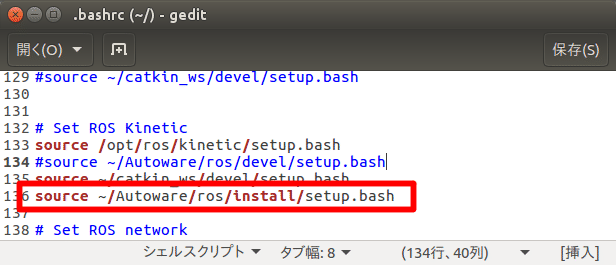

# 3.環境変数の設定

Autoware連携に先立ち、事前に環境変数を設定する。

※smagvビルド用（通常は、Autoware起動コマンド「run」内にて、同様のコマンドを発行しているのでたぶん不要）


## 設定済み確認

ターミナルで以下のコマンドを実行し、環境変数設定がされていることを確認する。

```command
$ rospack list
```

結果に「autoware_xxx」があれば環境変数設定に問題はない。なければ、以下「環境変数の設定」を実施する。


## 環境変数の設定

$HOME/.bashrc ファイルを開き、以下のコマンドを追記する。

```sh:.bashrc
source ~/Autoware/ros/devel/setup.bash      ← 1.10.0 の場合
source ~/Autoware/ros/install/setup.bash    ← 1.11.0 以降の場合
```

【追記例】

```command
$ gedit ~/.bashrc    ← エディタ起動
```



編集後、保存してエディタを閉じる。その後、ターミナルから以下のコマンドを実行、またはPC再起動し、環境変数の取込みを行う。

```command
$ source ~/.bashrc
```


処理終了後、前項に従い、設定済み確認を行う。


## その他

- 特になし

