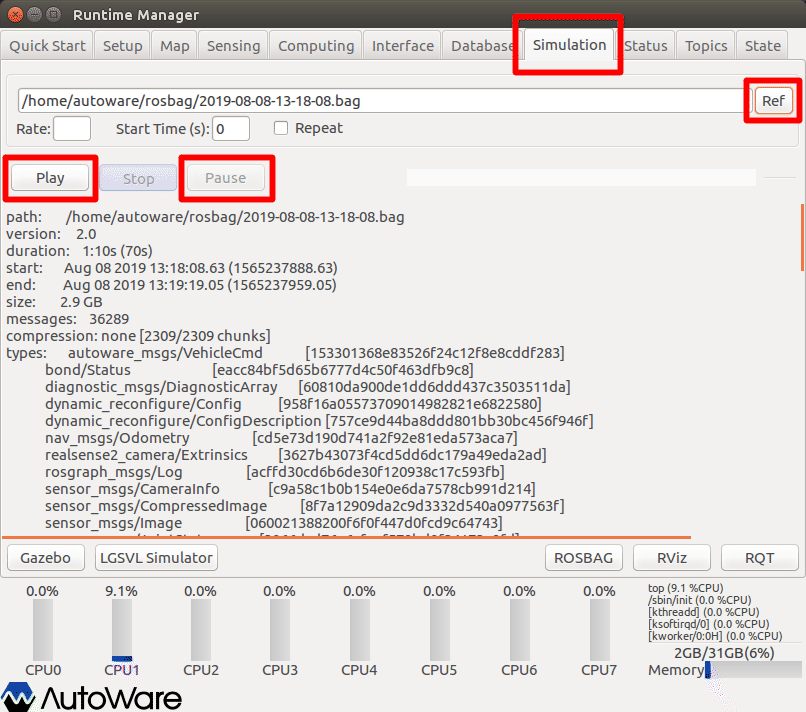
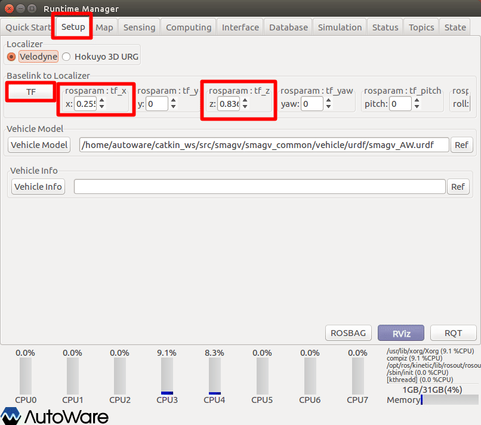
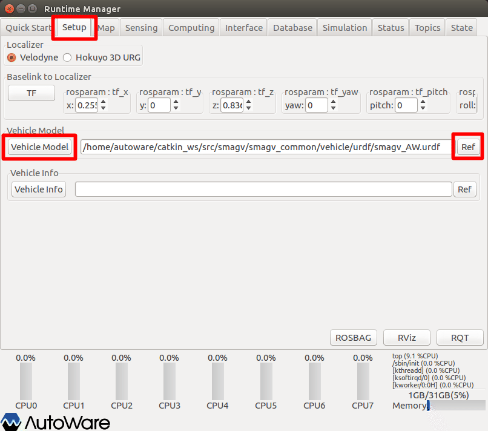
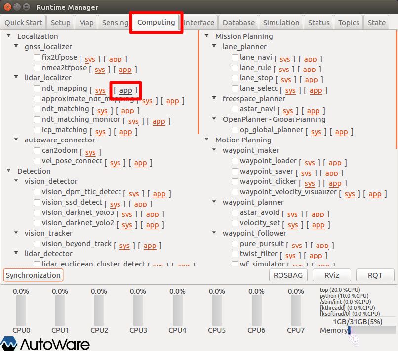
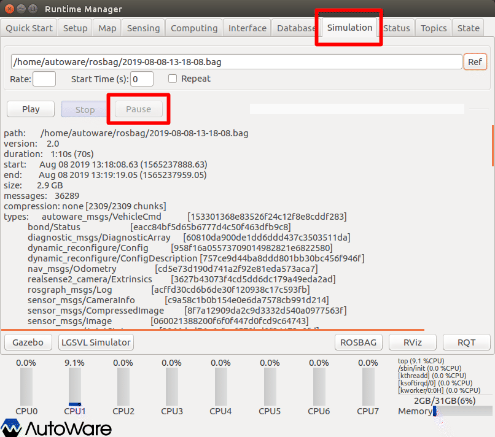
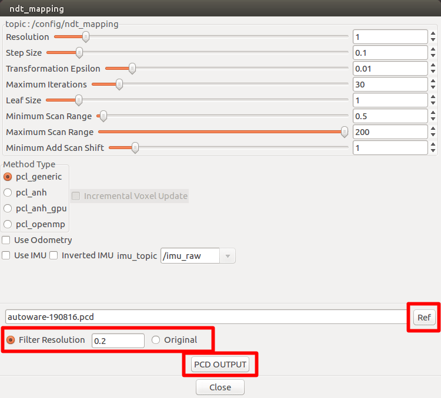

# 6.点群地図（NDT MAP、PCD）の作成

Autowareによる点群地図作成方法（作成済のROSBAGからの生成）を以下に示す。

※設定詳細は、「Autoware 自動運転ソフトウェア入門」P113参照


## 事前準備

情報をクリアするため、Autowareを再起動する。


## ROSBAG再生＆一時停止

ROSの時間をPCの時刻から、ROSBAG時刻に同期させるため、ROSBAG再生＆一時停止を行う。



1. Runtime Managerの［Simulation］タブを選択。
2. ［Ref］ボタン押下でROSBAGファイルを選択する。
3. ［Play］ボタン押下でROSBAGファイルを再生する。
4. 再生後すぐに［Pause］ボタン押下でROSBAGファイル再生を一時停止する。


## Baselink to Localizerの設定（任意）

base_linkから見た、lider（points_raw）のTFを設定する。

点群地図作成時には***必須ではない***が、NDTマッチングが正常動作しないことある。ただし、NDTマッチングの際に本項目を設定することで対応が可能なため適宜設定する。

（NDTマッチングの際に本項目を設定ようにした方がよい！？）



1. Runtime Managerの［Setup］タブを選択。
2. TF情報を入力する。
3. ［TF］ボタン押下で確定する。
4. 押下後、ボタン色反転することを確認する。


TF情報参考値

|  #   | 機種                  | tf_x  | tf_z  |
| :--: | --------------------- | ----- | ----- |
|  1   | SMAGV（HDL32E設置時） | 0.255 | 0.836 |
|  2   | SMAGV（VLP16設置時）  | 0.232 | 0.666 |
|  3   | LogieeS-TC            | 0.74  | 0.32  |


## Vihicle Modelの設定（任意）

RVizに表示するVihicle Modelを設定する。（表示が必要な場合のみ）



1. Runtime Managerの［Setup］タブを選択。
2. Vehicle Modelグループ［Ref］ボタン押下でロボットモデルファイルを選択する。
3. Vehicle Modelグループ［Vehicle Model］ボタン押下で確定する。
4. 押下後、ボタン色反転することを確認する。


## NDT mappingの設定

NDT mappingの設定を行う。



1. Runtime Managerの［Computing］タブを選択。
2. ndt_map項目［app］押下でパラメタ設定画面を表示する。


1. ndt_mappingパラメタ項目を適宜設定する。（※入力内容を反映するため、設定項目ごとにenterキーを入力すること。）
2. ［Close］ボタン押下で前画面に戻る。


※設定詳細は、「Autoware 自動運転ソフトウェア入門」P117参照

| #    | 項目名                 | 内容                                                         | 単位 | smagv妥当値 |
| ---- | ---------------------- | ------------------------------------------------------------ | :--: | ----------- |
| 1    | Resolution             | 地図データをNDTのボクセルに変換する際のボクセル１辺の長さを指定。市街地では１m程度が妥当。 |  m   | 1           |
| 2    | Step Size              | マッチングの計算で、ノード内部では直線探索法によって繰り返し計算を行っている。その際のステップ幅を表す。 |  -   | 0.1         |
| 3    | Transformation Epsilon | スキャンマッチングの繰り返し計算の収束条件を設定。           |  -   | 0.01        |
| 4    | Maximum Iteration      | 繰り返し計算における、最大の繰り返し数を表す。収束条件を満たさない場合は、この数値の回数だけ繰り返し計算を行ったら自動的に計算を打ち切る。 |  回  | 30          |
| 5    | Leaf Size              | スキャンデータのダウンサンプリングサイズ。                   |  m   | 1           |
| 6    | Minimum Scan Range     | 特定の距離よりも近いスキャンポイントを無視する。（取り付けた車体をLiderが検知しないようにするため。） |  m   | 0.5         |
| 7    | Maximum Scan Range     | 特定の距離よりも遠いスキャンポイントを無視する。             |  ｍ  | 100         |
| 8    | Minimum Add Scan Shift | Lider点群を地図として追加する頻度（移動距離）。0の場合はすべてのSCANデータ。（小さくすると処理が重くなる。） |  m   | 0.5～1.5    |


1. ndt_map項目チェックBOXをチェックありにする。
2. ［RViz］ボタン押下でRVizを起動する。


## RVizの設定

RViz起動後、defaultのRViz設定ファイルを開く。（~/Autoware/ros/src/.config/rviz/default.rviz）

その後、以下topic表示を追加する。


- ［add］押下で追加トピック選択画面を表示する。


1. 追加トピック選択画面の［by topic］タブを選択。
2. ［/ndt_map］トピックの［PointsCloud2］を選択する。
3. ［OK］ボタン押下で確定する。


## ROSBAG一時停止からの再生

一時停止中のROSBAGを再生する。



1. Runtime Managerウィンドウから、［Simulation］タブを選択。
2. ［Pause］ボタン押下でROSBAGファイル再生を開始する。


## NDTMAP作成の確認

RVizウィンドウに切り替え、点群地図が作成されていくことを確認する。

RViz表示の処理がだんだん重くなっていくので、前画面のROSBAG再生の終了を確認したらRVizを閉じる。（RVizを閉じても、NDTマップ作成の処理は継続している。）

別ターミナルウィンドウに、以下のようなNDTマップの作成状況が表示されているので、終了（分母分子が同じになる）するまで待つ。

```
---------------------------------------------------
（Processed/Input）:（xxxxx/〇〇〇〇）
---------------------------------------------------
```


## 点群地図の保存

ROSBAG再生終了後、作成した点群地図を保存する。

NDT mappingの設定を行う。


1. Runtime Managerの［Computing］タブを選択。
2. ndt_map項目［app］押下でパラメタ設定画面を表示する。




1. ［Ref］ボタン押下で点群地図ファイル（.pcd）を選択する。
2. フィルター（地図データをNDTのボクセルに変換する際のボクセル１辺の長さ）を指定する。（狭いエリアであれば「Original」選択でもよい。）
3. ［PCD OUTPUT］ボタン押下でファイルを書き出す。
4. 他のターミナルウィンドウに「Saved xxxxxx data points to xxxxxx.pcd.」を表示すれば保存完了。


## その他

- 作成した地図は、作成を開始した箇所が原点となっている。
- 作成した地図を自己位置推定に使用する場合、［Map］タブ［TF］項目を設定する必要がある。
- 旋回動作や、スピードが速いとMAP生成でズレが発生することがあるため、旋回動作は少なく、ゆっくりのスピードで作成を行うこと。


