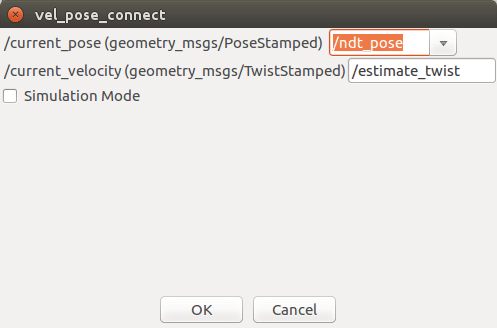
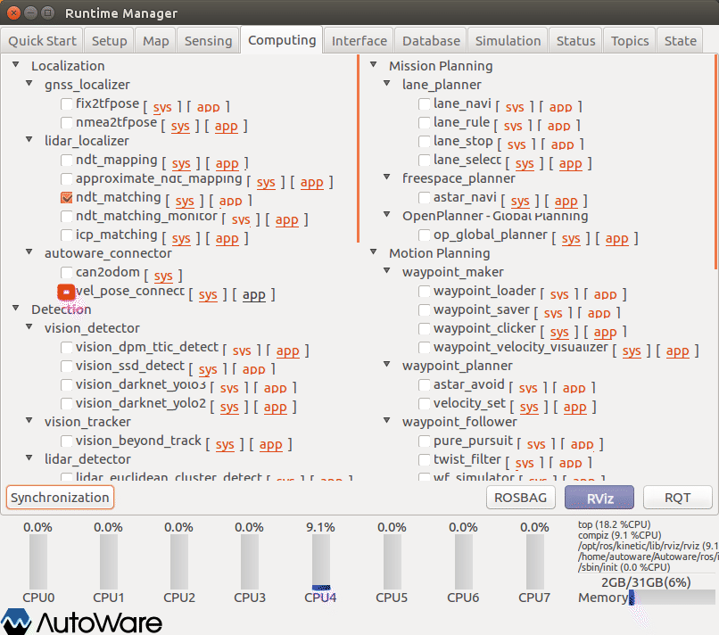
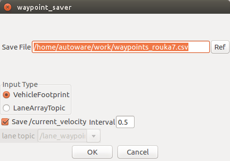

# 経路設定ファイル作成

ROSBAGに取得した走行履歴をもとに経路設定（waypoint）ファイルの作成方法を以下に示す。

事前に、以下の準備をしておくこと。

・AGVの自己位置推定設定（※ROSBAG再生 ~ ROSBAG一時停止の再開直前まで）

## AGVの推定姿勢・速度算出の設定

AGVの推定姿勢・速度算出のため、｢vel_pose_connect｣を設定する。

1. Runtime Managerの［Computing］タブを選択。

2. vel_pose_connect項目［app］押下でパラメタ設定画面を表示する。

1. vel_pose_connectパラメタ項目を適宜設定する。（※設定内容はたぶん画面内容のままでよい。）
2. ［OK］ボタン押下で前画面に戻る。

※設定詳細は、「Autoware 自動運転ソフトウェア入門」P158参照

1. vel_pose_connect項目チェックBOXをチェックありにする。

## waypoint saverの設定

AGVの姿勢・速度をもとに、waypointファイルを作成するための設定をする。

1. Runtime Managerの［Computing］タブを選択。

2. waypoint_saver項目［app］押下でパラメタ設定画面を表示する。

1. waypoint_saverパラメタ項目を適宜設定する。
2. ［OK］ボタン押下で前画面に戻る。

|  #   | 項目名        | 内容                                                         | 単位 | smagv妥当値 |
| :--: | ------------- | ------------------------------------------------------------ | ---- | ----------- |
|  1   | Save File     | 出力するwaypointファイル名。（新規ファイル名を設定すること。） | -    | -           |
|  2   | Input Type    | -                                                            | -    | Vehicle･･･  |
|  3   | Save/curre･･･ | チェックありにし、ポイント取得間隔を設定する。               | ｍ   | 0.5         |

1. waypoint_saver項目チェックBOXをチェックありにする。

## ROSBAG再生の再開

一時停止しているROSBAG再生を再開をする。

RViz表示で、走行経路上にwaypointが、表示されていくことを確認する。

## その他

- 動作完了後、指定したCSVファイルが作成されていることを確認する。

