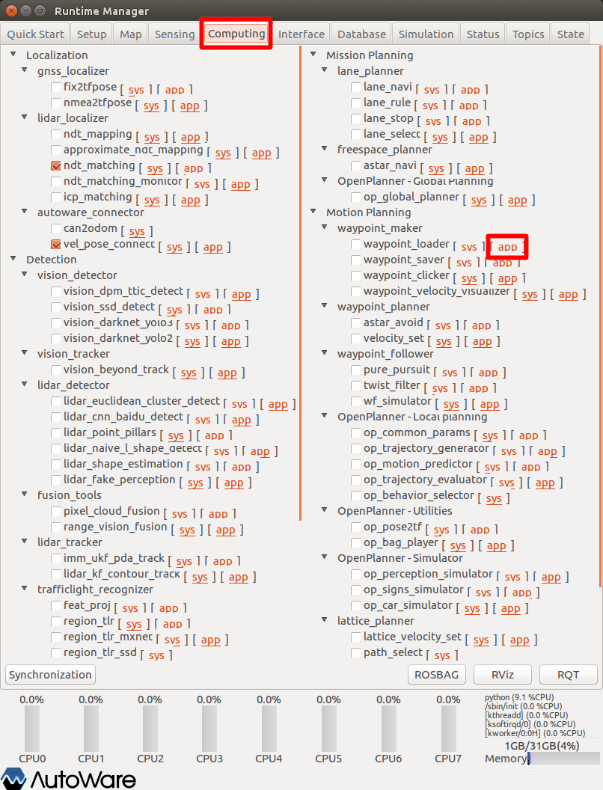
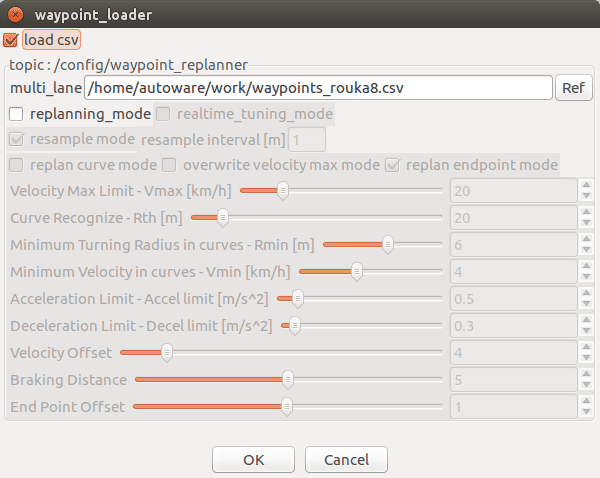
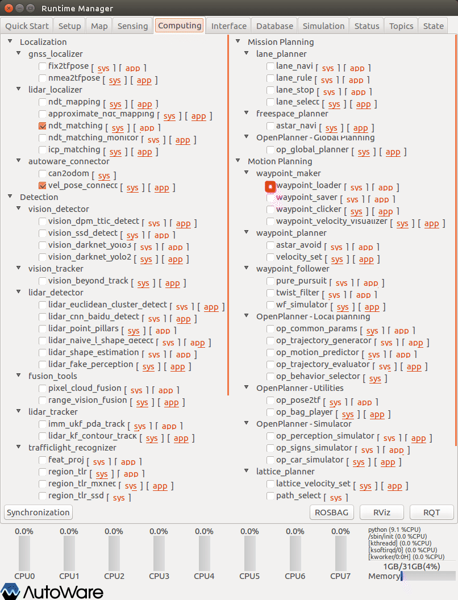
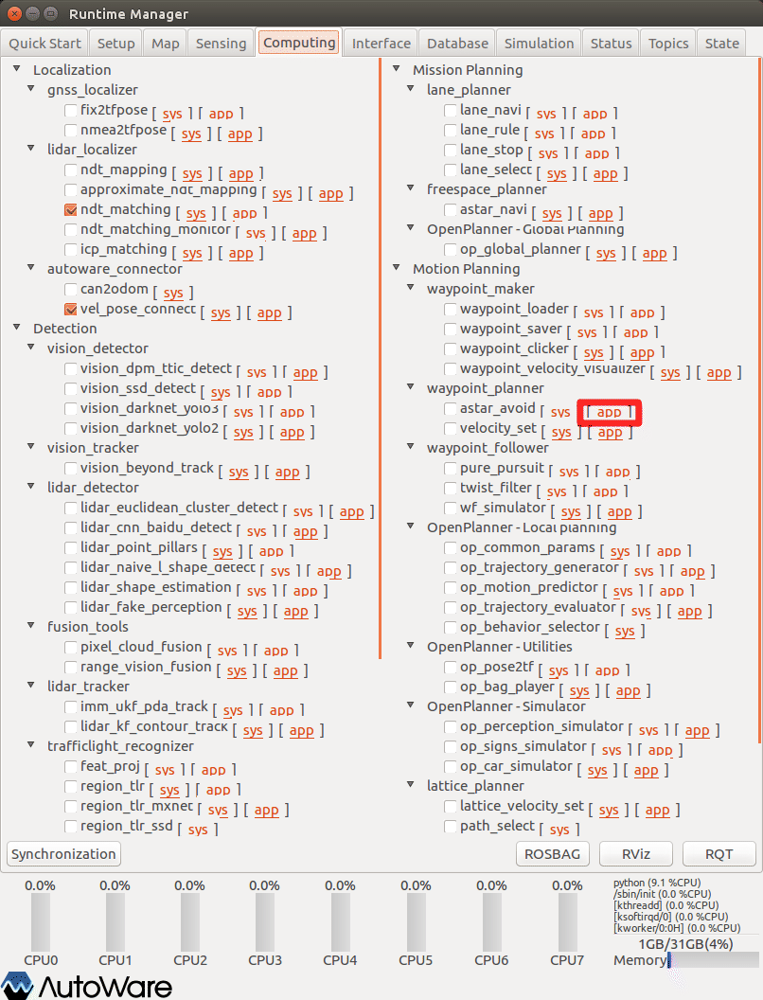
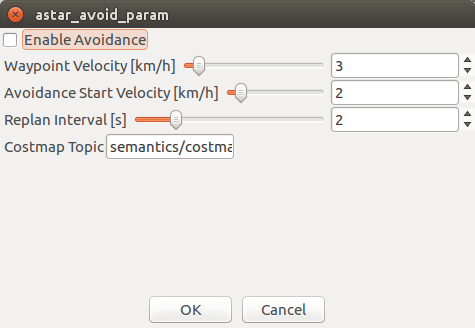
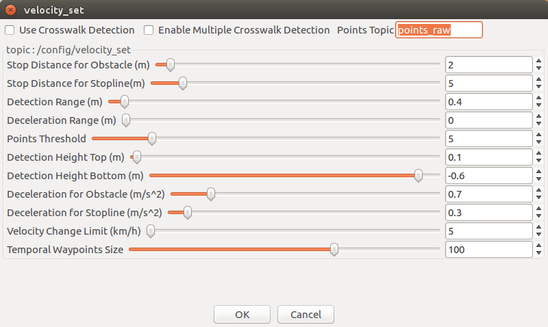
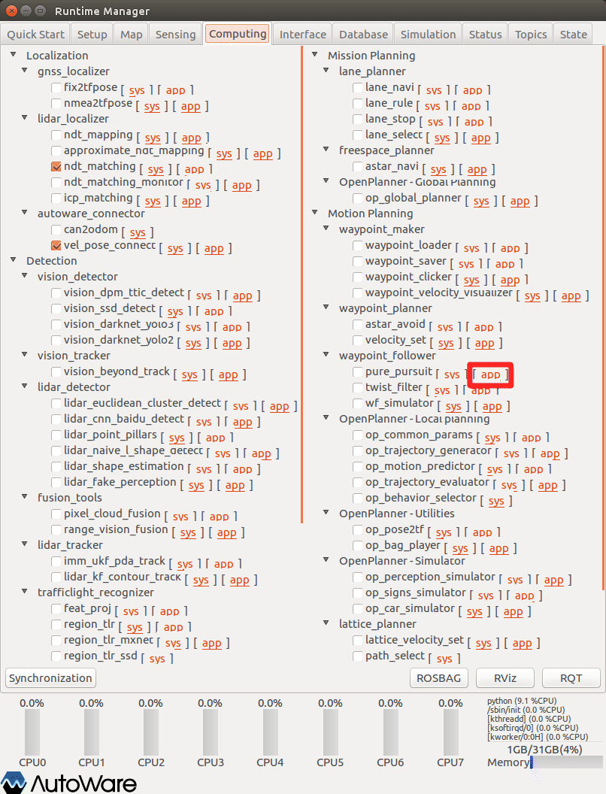
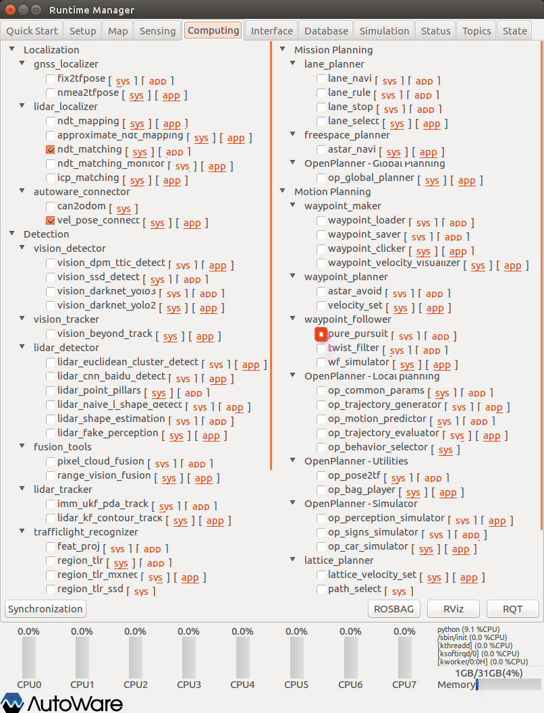
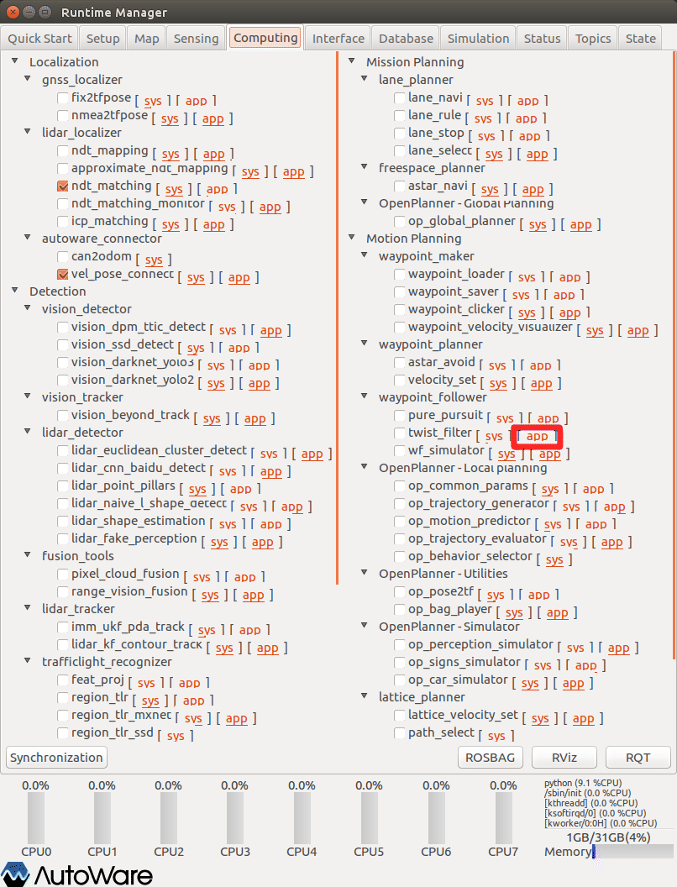
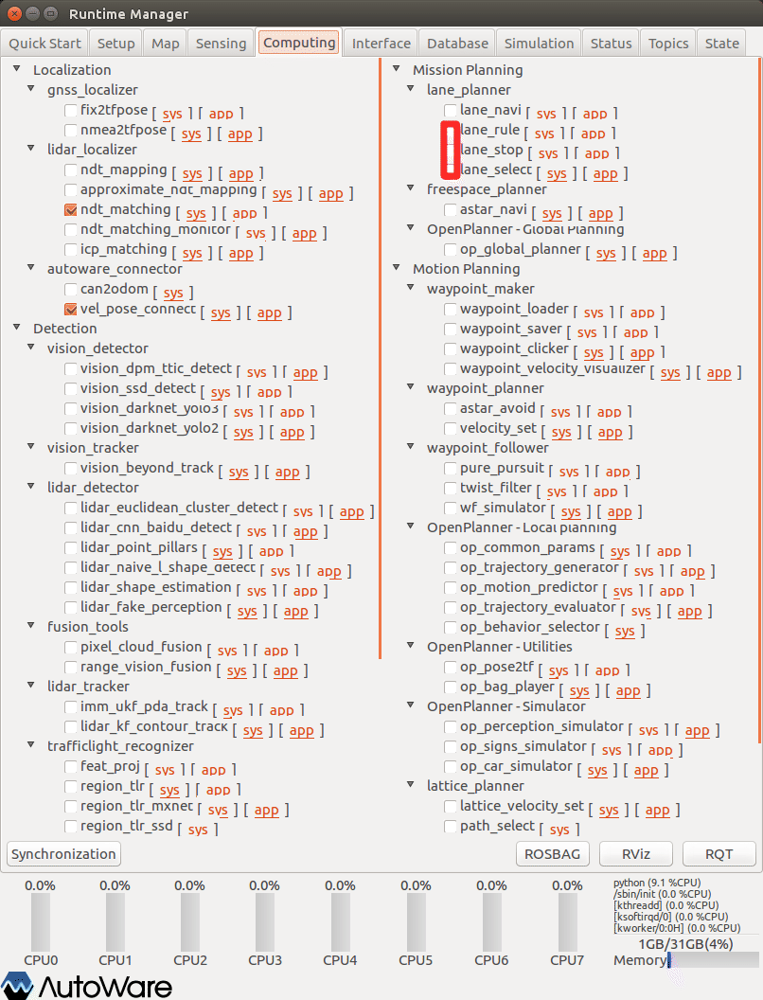

# 経路の自動走行

作成した経路設定（waypoint）ファイルに従い自動走行を行う方法を以下に示す。

## 事前準備

事前に以下の準備をしておくこと。

### 準備1

#### Autoware関連launchファイルの変更

障害物として検知しない距離の設定を行う。（無視する半径）

AGV本体（車体）を障害物として検知しないよう設定する。

| 項目       | 内容                                                         | 備考   |
| ---------- | ------------------------------------------------------------ | ------ |
| ファイル名 | velocity_set.launch                                          | -      |
| 格納先     | ~/Autoware/ros/install/waypoint_planner/share/waypoint_planner/launch | 1.11.1 |
| 〃         | ~/Autoware/ros/src/computing/planning/motion/packages/astar_planner/launch | 1.10.0 |


変更内容

```xml
<launch>
  <arg name="use_crosswalk_detection" default="true" />
  <arg name="points_topic" default="points_no_ground" />
  <arg name="velocity_offset" default="1.2" />
  <arg name="decelerate_vel_min" default="1.3" />
  <arg name="remove_points_upto" default="0.5" /> 
              ↑ここの値を変更する（0.4~0.5が妥当）(default:2.3)
  <arg name="enable_multiple_crosswalk_detection" default="true" />
  <arg name="enablePlannerDynamicSwitch" default="false" />

  <node pkg="waypoint_planner" type="velocity_set" name="velocity_set" output="screen">
    <param name="use_crosswalk_detection" value="$(arg use_crosswalk_detection)" />
    <param name="enable_multiple_crosswalk_detection" value="$(arg enable_multiple_crosswalk_detection)" />
    <param name="points_topic" value="$(arg points_topic)" />
    <param name="velocity_offset" value="$(arg velocity_offset)" />
    <param name="decelerate_vel_min" value="$(arg decelerate_vel_min)" />
    <param name="remove_points_upto" value="$(arg remove_points_upto)" />
    <param name="enablePlannerDynamicSwitch" value="$(arg enablePlannerDynamicSwitch)" />
  </node>

</launch>

```

上記 6行目の「remove_points_upto」の値を変更する。（点群データを無視する範囲（センサからの距離）、半径。）

設定した内容は、Runtime Manager［Computing］タブ－［velocity_set］項目のチェックBOXを「チェックあり」にした時に反映する。反映がうまくいかない場合は、Autowareの再起動を行う。


### 準備2

その他、以下の準備をしておくこと。

- velodyne、SMAGVの起動。

- AGVの自己位置推定設定。


## AGVの推定姿勢・速度算出の設定

AGVの推定姿勢・速度算出のため、｢vel_pose_connect｣を設定し、チェックありにする。

詳細は前章参照のこと。


## waypoint_loaderの設定

waypointファイルの読み込み設定をする。



1. Runtime Managerの［Computing］タブを選択。

2. waypoint_loader項目［app］押下でパラメタ設定画面を表示する。




1. waypoint_loaderパラメタ項目を適宜設定する。
2. ［OK］ボタン押下で前画面に戻る。


|  #   | 項目名     | 内容                         | 単位 | 備考 |
| :--: | ---------- | ---------------------------- | :--: | ---- |
|  1   | load csv   | CSVファイル読込み有無。      |  -   | -    |
|  2   | multi_lane | 読み込むwaypointファイル名。 |  -   | -    |
|  3   | 調整中     |                              |  -   | -    |




1. waypoint_loader項目チェックBOXをチェックありにする。


## waypoint_planner（astar_planner）項目の設定

以下、waypoint_planner項目を設定する。（Autowareバージョンによっては、「astar_planner」となっている場合があるので読み替えのこと。）

### aster_avoid（obstacle_avoid）の設定

経路上の障害物に対して回避経路を生成するための設定をする。

以下、aster_avoid項目を設定する。（Autowareバージョンによっては、「obstacle_avoid」となっている場合があるので読み替えのこと。）



1. Runtime Managerの［Computing］タブを選択。
2. aster_avoid項目［app］押下でパラメタ設定画面を表示する。




1. aster_avoidパラメタ項目を適宜設定する。
2. ［OK］ボタン押下で前画面に戻る。


|  #   | 項目名 | 内容 | 単位 | 備考 |
| :--: | ------ | ---- | :--: | ---- |
|  1   | 調整中 |      |      | -    |


1. aster_avoid項目チェックBOXをチェックありにする。


### velocity_setの設定

経路上の物体を検出し、最終的な速度を決定するための設定をする。

以下、velocity_set項目を設定する。


1. velocity_set項目［app］押下でパラメタ設定画面を表示する。




1. velocity_setパラメタ項目を適宜設定する。
2. ［OK］ボタン押下で前画面に戻る。


※設定詳細は、「Autoware 自動運転ソフトウェア入門」P163参照

|  #   | 項目名                              | 内容                                                         | 単位  | SMAGV妥当値 | 備考      |
| :--: | ----------------------------------- | ------------------------------------------------------------ | :---: | :---------: | --------- |
|  1   | Use Crosswalk Detection             | 横断歩道上の物体を検出するかどうかを選択する。               |   -   |      -      | -         |
|  2   | Enable Multiple Crosswalk Detection | 複数の横断歩道を検出対象とするかどうかを選択する。           |   -   |      -      | -         |
|  3   | Points Topic                        | 物体検出に利用する点群トピック名を指定する。                 |   -   | points_raw  | -         |
|  4   | Enable Planner dynamical switch     | waypointを動的に書き換えるかどうかを指定する。               |   -   |      -      | 1.10.0    |
|  5   | Stop Distance for Obstacle          | 経路上の物体を検知した際の前方障害物までの停止距離を指定する。 |   m   |      2      | 1未満危険 |
|  6   | Stop Distance for Stopline          | 経路上の停止線までの停止距離を指定する。                     |   m   |      5      | -         |
|  7   | Detection Range                     | 経路上の物体を検出して停止する際の検出範囲を指定する。       |   m   |     0.4     | -         |
|  8   | Deceleration Range                  | 経路上の物体を検出して減速する際の検出範囲を指定する。       |   m   |     ０      | -         |
|  9   | Points Threshold                    | 経路上の物体を検出する際の点の数のしきい値を指定する。この値以上の点が検出範囲内にあれば物体を検出する。 |  個   |      5      | -         |
|  10  | Detection Height Top                | 検出する点群の高さの上限を指定する。高さは点群の検出に用いているセンサからの距離。 |   m   |     0.3     | -         |
|  11  | Detection Height Bottom             | 検出する点群の高さの下限を指定する。                         |   m   |    -0.9     | -         |
|  12  | Deceleration for Obstacle           | 物体を検出して停止・減速する際の減速度を指定する。           | m/s^2 |     0.7     | -         |
|  13  | Deceleration for Stopline           | 停止線を検出して停止・減速する際の減速度を指定する。         | m/s^2 |     0.3     | -         |
|  14  | Velocity Change Limit               | 現在速度と目標速度の差がこの値より大きくならないようにする。急ブレーキを回避するためのパラメタ。 | km/h  |      7      | -         |
|  15  | Tempral Waypoint Size               | 次のノードに渡すためにPublishするwaypointの数を指定する。    |  個   |     100     | -         |


1. velocity_set項目チェックBOXをチェックありにする。


## waypoint_follower項目の設定

以下、waypoint_follower項目を設定する。（Autowareバージョンによっては、項目の位置が異なる場合がある。）

### pure_pursuitの設定

自己位置から目標位置までの曲率（滑らかなカーブにする）を求めるためのアルゴリズムの設定をする。

以下、pure_pursuit項目を設定する。



1. Runtime Managerの［Computing］タブを選択
2. pure_pursuit項目［app］押下でパラメタ設定画面を表示する


1. pure_pursuitパラメタ項目を適宜設定する
2. ［OK］ボタン押下で前画面に戻る


※設定詳細は、「Autoware 自動運転ソフトウェア入門」P177,179,180参照

|  #   | 項目名                      | 内容                                                         | waypoint | Dialog | 単位 | smagv妥当値 |
| :--: | --------------------------- | ------------------------------------------------------------ | :------: | :----: | :--: | ----------- |
|  1   | Waypoint                    | 目標速度をwaypointファイルに定義されている速度から取得する。（**<u>通常はこちらを使用する</u>**） |    〇    |        |  -   | 〇          |
|  2   | Dialog                      | Velocityパラメタから取得する。（**<u>この項目を選択すると、障害物を検知しても、停止しない</u>**） |          |   〇   |  -   | -           |
|  3   | Velocity                    | 目標速度（固定値）。ターゲットボールの移動速度。             |          |   〇   | km/h | -           |
|  4   | Lookahead Distance          | 目標点までの距離（固定値）。ターゲットボールまでの距離。     |          |   〇   |  m   | 1.0~2.0     |
|  5   | lookahead_ratio             | 目標点を決めるパラメタ。その速度で何秒先に到達する位置を目標点とするかを表す。 |    〇    |        |  秒  | 2.0~2.5     |
|  6   | minimum_lookahead_ distance | 目標点までの距離の最低値。                                   |    〇    |        |  m   | 0.5~1.0     |




1. pure_pursuit項目チェックBOXをチェックありにする。


### twist_filterの設定

自己位置から目標位置までの曲率を求めるためのアルゴリズムの設定をする。

以下、twist_filter項目を設定する。



1. Runtime Managerの［Computing］タブを選択。
2. twist_filter項目［app］押下でパラメタ設定画面を表示する。


1. twist_filterパラメタ項目を適宜設定する。
2. ［OK］ボタン押下で前画面に戻る。


※設定詳細は、「Autoware 自動運転ソフトウェア入門」P177参照

| #    | 項目名                 | 内容                                                         | 単位  | smagv妥当値 |
| ---- | ---------------------- | ------------------------------------------------------------ | :---: | ----------- |
| 1    | lateral_accel_limit    | 横加速度（m/s^2）の許容範囲。                                | m/s^2 | ？          |
| 2    | lowpass_gain_linear_x  | 目標並進速度に対するローパスフィルタのゲイン。縦速度の許容範囲を表す。 |       | ？          |
| 3    | lowpass_gain_angular_z | 目標角速度に対するローパスフィルタのゲイン。横回転速度の許容範囲を表す。 |       | ？          |


1. twist_filter項目チェックBOXをチェックありにする。


## lane_planner項目の設定

以下、lane_planner項目を設定する。




1. lane_rule項目チェックBOXをチェックありにする。
2. lane_stop項目チェックBOXをチェックありにする。
3. lane_select項目チェックBOXをチェックありにする。


## トピックの確認

Runtime Managerの［Topics］タブを選択し、［/vehicle_cmd］トピックがPublishされていることを確認する。

（echoありで、linear、angularのデータが変化していることを確認する）


## SMAGVの自動運転切り替え

Bluetoothゲームパッドの［Y］ボタン押下で自動走行モードに切り替え、AGVが自動走行することを確認する。


Bluetoothゲームパッドによるの走行モード切替えボタン

|         ボタン         | 走行モード               | 内容                                                         | 有効トピック             |
| :--------------------: | ------------------------ | ------------------------------------------------------------ | ------------------------ |
|           Ｘ           | 手動走行（ゲームパッド） | Bluetoothゲームパッドの左スティックによる手動制御へ切替える。 | /smagv/vehicle_cmd       |
|           Ｙ           | 自動走行                 | Autowareからのトピックによる命令、またはrosからのトピックによる命令へ切替える。 | /vehicle_cmd 、 /cmd_vel |
|           Ｂ           | 手動走行（JWスティック） | アカデミックパック本体設置のジョイスティックによる制御へ切替える。 | -                        |
| Ａ＋左スティック押込み | 緊急停止                 | アカデミック電源Off。押込みをやめると電源を復帰する。電源復帰後は、手動走行（ゲームパッド）モードになる。 | -                        |


## その他

- 特になし

