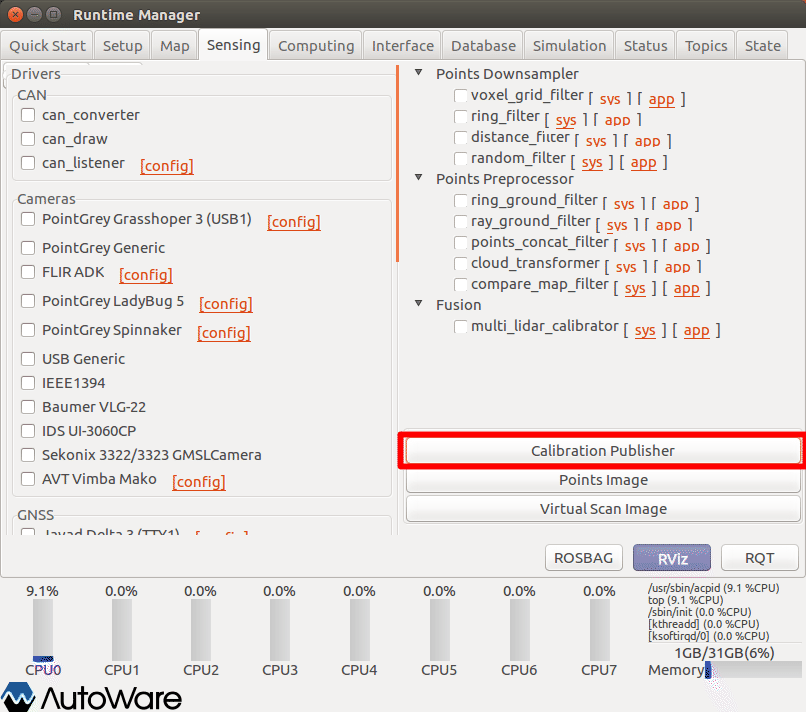
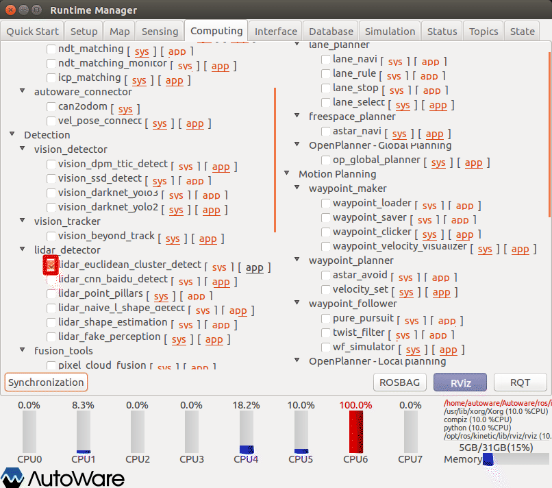
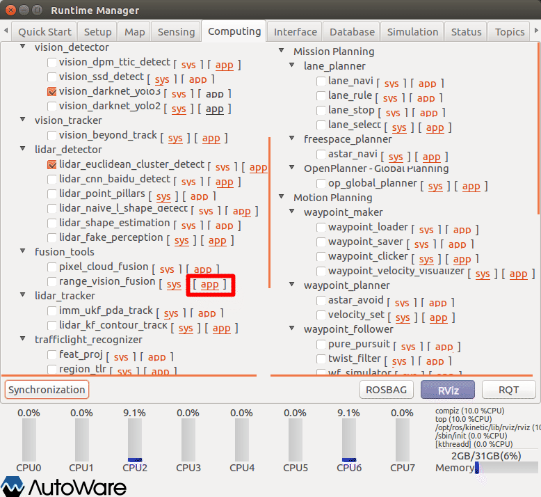
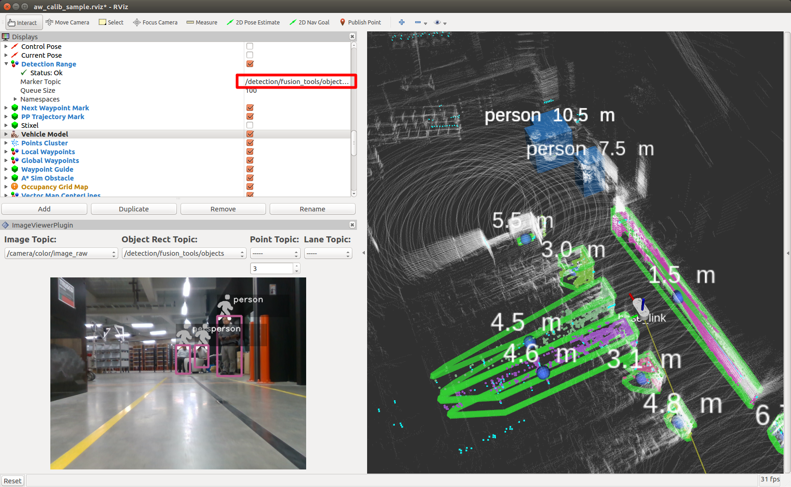
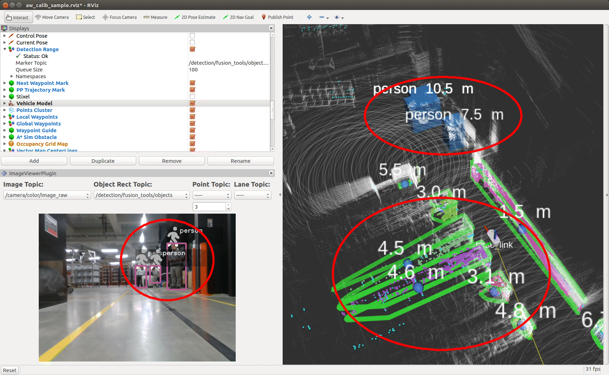

# 14.物体検出（センサフュージョン）

キャリブレーションパラメタによるセンサフュージョンを行う。（点群、画像連携による障害物検出）

※設定詳細は、「Autoware 自動運転ソフトウェア入門」P133参照

## 事前準備

事前に以下の準備をしておくこと。

### 準備1

#### センサキャリブレーション

センサキャリブレーションによる、パラメタの作成を行う。（付録2参照）

#### groundトピックの発行

groundトピックの発行設定を行う。（以下いずれかをチェックする。）

内容については、10章参照のこと。

### 準備2

以下のいずれかを準備しておくこと。

- velodyne、SMAGVの起動
- ROSBAG再生の一時停止

## キャリブレーションパブリッシャの起動

calibration_publisher項目の設定をする。

1. Runtime Managerの［Sensing］タブを選択。
2. calibration_publisherボタン押下でパラメタ設定画面を表示する。

1. calibration_publisherパラメタ項目を適宜設定する。
2. ［OK］ボタン押下で前画面に戻る。

|  #   | 項目名                  | 内容                           | 単位 | smagv妥当値                                                  |
| :--: | ----------------------- | ------------------------------ | :--: | ------------------------------------------------------------ |
|  1   | Camera ID               | 画像データID                   |  -   | /camera/color                                                |
|  2   | target_frame            | 点群データフレーム名           |  -   | velodyne                                                     |
|  3   | camera_frame            | 画像データフレーム名           |  -   | /camera_color_frame                                          |
|  4   | -                       | キャリブレーションパラメタpath |  -   | /hoge/YYYYMMDD_HHMMSS_autoware_  lider_camera_calibration_yaml |
|  5   | register TF ･･･         |                                |  -   | チェックあり                                                 |
|  6   | publish extrinsic ･･･   |                                |  -   | チェックあり                                                 |
|  7   | publish camera ･･･      |                                |  -   | チェックあり                                                 |
|  8   | camera_info_topic_name  |                                |  -   | /camera_info                                                 |
|  9   | image_topic_source      |                                |  -   | /camera/color/image_raw                                      |
|  10  | projection_matrix_topic |                                |  -   | /projection_matrix ?                                         |

※処理途中で本項目を再度設定した場合は、後述の「range_vision_fusion」項目に影響するため、range_vision_fusion項目も再設定、起動を行うこと。

## 点群クラスタの起動

点群クラスタと起動する。

## 物体検出アルゴリズムの起動

以下のいずれかを起動する。内容については、13章参照のこと。

- SSD
- YOLO v2
- YOLO v3

## range_vision_fusionの起動

range_vision_fusion項目の設定をする。

1. Runtime Managerの［Computing］タブを選択。
2. range_vision_fusion項目［app］押下でパラメタ設定画面を表示する。

1. range_vision_fusionパラメタ項目を適宜設定する。
2. ［OK］ボタン押下で前画面に戻る。

|  #   | 項目名                 | 内容                       | 単位 | smagv妥当値                       |
| :--: | ---------------------- | -------------------------- | :--: | --------------------------------- |
|  1   | detected_objects_range | 物体検出（点群）トピック名 |  -   | /detection/lider_detector/objects |
|  2   | detected_objects_range | 物体検出（画像）トピック名 |  -   | /detection/lider_detector/objects |
|  3   | camera_info_src        |                            |  -   | /camera/color/camera_info         |
|  4   | 調整中                 |                            |      |                                   |

1. range_vision_fusion項目チェックBOXをチェックありにする。

## RVizの設定

RViz起動後、defaultのRViz設定ファイルを開く。（~/Autoware/ros/src/.config/rviz/default.rviz）

その後、以下設定を行う。

### Image Viewer Pluginパネルの表示
Image Viewer PluginパネルをRViz上に表示する。

内容については、13章参照のこと。

1. 画面のプルダウンメニューから以下を選択する。（rosbag再生一時停止の場合、選択項目が見つからないことがあるので、いったん一時停止を解除し、再度一時停止する。）

|  #   | 項目名            | 内容                       | smagv妥当値                     |
| :--: | ----------------- | -------------------------- | :------------------------------ |
|  1   | Image Topic       | 画像データトピック名       | /camera/color/image_raw         |
|  2   | Object Rect Topic | 矩形オブジェクトトピック名 | /detection/fusion_tools/objects |

### 表示重なりトピックの非表示

RViz上に表示が重なっていて見づらくしているPoints Rawトピックを非表示にする。

内容については、13章参照のこと。

### センサフュージョン検出マーカーの表示

センサフュージョン検出マーカーの表示設定を行う。

1. マーカー表示「Detection Range」項目の「Marker Topic」のプルダウンメニューから「/detection/fusion_tools/objects_markers」を選択する。

## 認識結果の確認

認識結果の種類、矩形、マーカー、距離等が表示されることを確認する。

## その他

- ROSBAG再生を一時停止している場合は、再生再開をする。

  

## 正しく表示しないとき

正しく表示しない場合、以下を実施しすることで改善する場合がある。

- RVizの［Displays］ウィンドウ－［Global Options］－［Fixed Frame］を見直す。

- URDFによるTF定義では、Lider⇔カメラのTFリンクが辿れなくなる（ような動作になっている）。明示的にTFを定義し直すこと。（NDT matchingと同時利用する場合は、再起動した方が手っ取り早いかも...）

  以下仮対策

  | 種類                               | 仮対策方法                                           | 備考 |
  | ---------------------------------- | ---------------------------------------------------- | ---- |
  | rosbag再生によるシミュレーション時 | rosbagを停止（一時停止でない）し、初めから再生する。 |      |
  | roslaunch実行による実機稼働時      | roslaunchを停止し、再度roslaunchを実行する。         |      |

  ・TFのツリー構造見直しで対応可能かも...あとで検討する。
  
  

