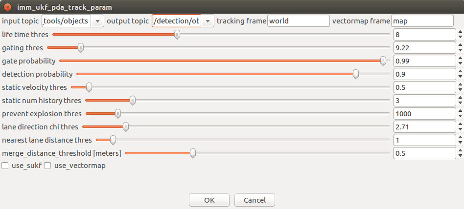
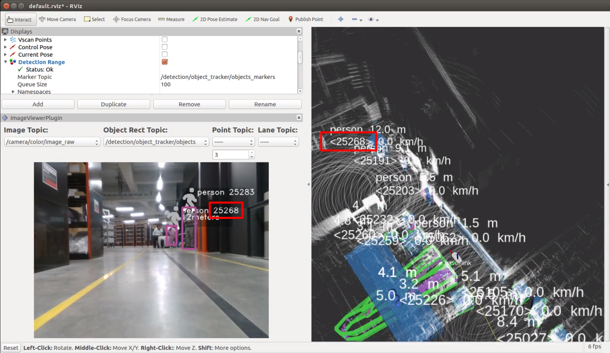

# 15.物体検出（クラスタトラッキング）

物体認識のみでは、時間フレーム毎に認識を行うので、時間フレーム毎に結果が変動してしまう。そこで物体ごとにIDを与え、時間変化をしても同じ物体を認識し続けるトラッキングを行う必要がある。

※設定詳細は、「Autoware 自動運転ソフトウェア入門」P136参照

## 事前準備

章14.物体検出（センサフュージョン）を行う。

ROSBAG再生の場合は一時停止しておく。

## imm_ukf_pda_trackの起動

imm_ukf_pda_track項目の設定をする。

1. Runtime Managerの［Computing］タブを選択。
2. imm_ukf_pda_track項目［app］押下でパラメタ設定画面を表示する。

1. imm_ukf_pda_trackパラメタ項目を適宜設定する。
2. ［OK］ボタン押下で前画面に戻る。

|  #   | 項目名       | 内容           | 単位 | smagv妥当値                       |
| :--: | ------------ | -------------- | :--: | --------------------------------- |
|  1   | input topic  | 入力トピック名 |  -   | /detection/fusion_tools/objects   |
|  2   | output topic | 出力トピック名 |  -   | /detection/object_tracker/objects |
|  3   | 調整中       |                |  -   |                                   |

1. range_vision_fusion項目チェックBOXをチェックありにする。

## RVizの設定

表示しているRVizの表示topicを変更する。

### Image Viewer Pluginパネルの表示

1. 画面のプルダウンメニューから以下を選択する。（rosbag再生一時停止の場合、選択項目が見つからないことがあるので、いったん一時停止を解除し、再度一時停止する。）

|  #   | 項目名            | 内容                       | smagv妥当値                       |
| :--: | ----------------- | -------------------------- | :-------------------------------- |
|  1   | Image Topic       | 画像データトピック名       | /camera/color/image_raw           |
|  2   | Object Rect Topic | 矩形オブジェクトトピック名 | /detection/object_tracker/objects |

### クラスタトラッキング検出マーカーの表示

クラスタトラッキング検出マーカーの表示設定を行う。

1. マーカー表示「Detection Range」項目の「Marker Topic」のプルダウンメニューから「/detection/object_tracker/objects_markers」を選択する。

## 認識結果の確認

認識結果にIDが付与され表示することを確認する。

## その他

- ROSBAG再生を一時停止している場合は、再生再開をする。

## 正しく表示しないとき

正しく表示しない場合、以下を実施しすることで改善する場合がある。

- RVizの［Displays］ウィンドウ－［Global Options］－［Fixed Frame］を見直す。
- rosbagを停止（一時停止でない）し、初めから再生する。

