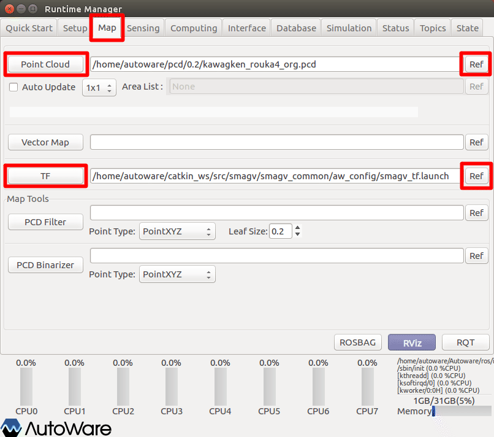
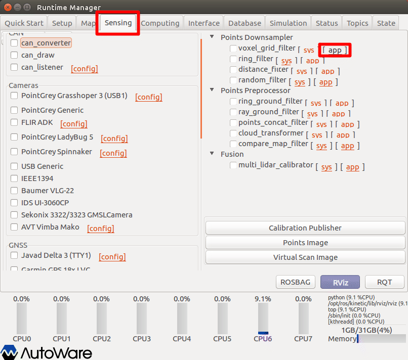
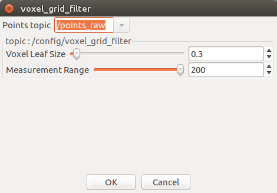
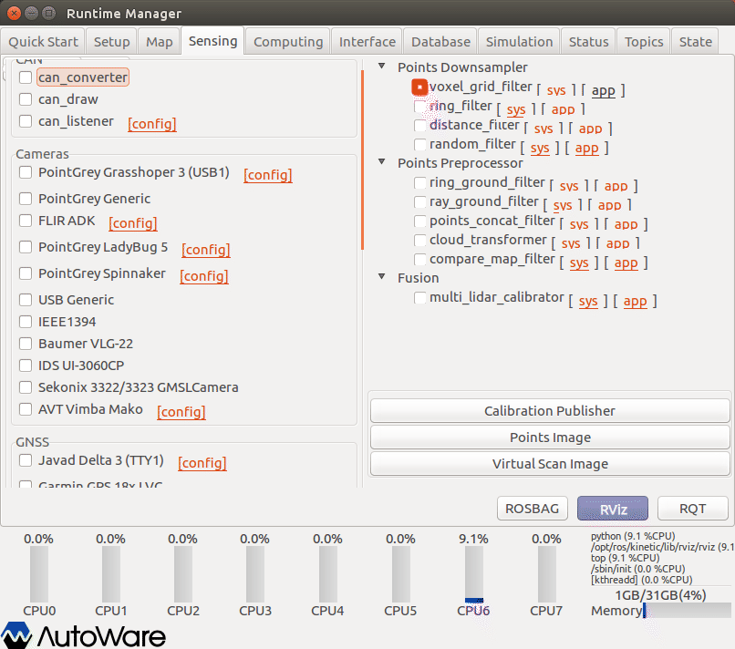
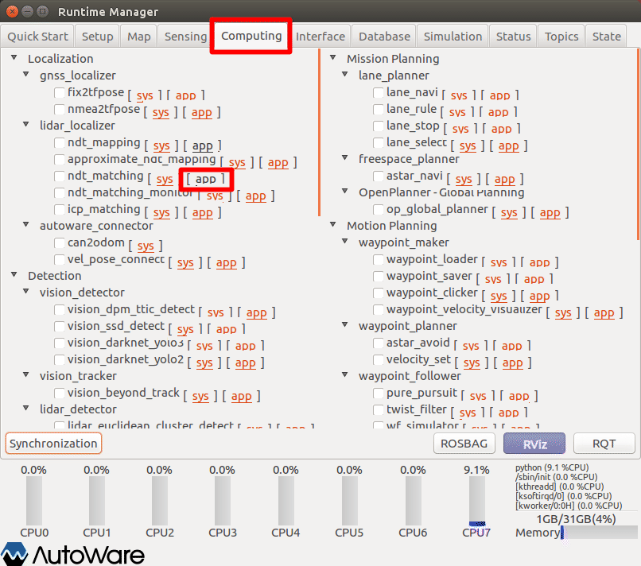
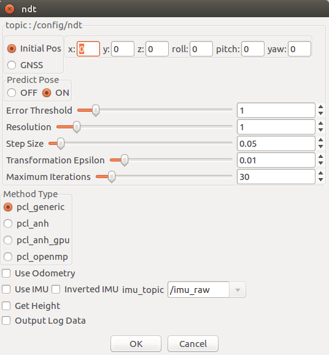
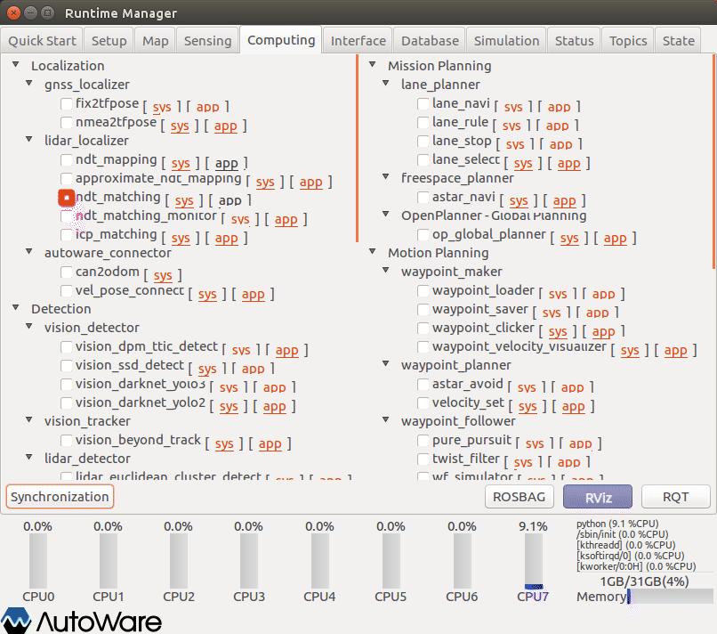

# AGVの自己位置推定

Autowareによる自己位置推定方法（点群地図とのマッチング）を以下に示す。

事前に、以下のいずれかを準備しておくこと。

- velodyne、SMAGVの起動
- ROSBAG再生の一時停止

## Baselink to Localizerの設定（任意）

base_linkから見た、lider（points_raw）のTFを設定する。

点群地図作成時に、「Baselink to Localizer」を設定している場合、本設定は必須ではない。（たぶん）

点群地図作成時に、本項目を設定していない場合でも、本タイミングで設定することでマッチングが正常動作することがある。

詳細については、前章参照。

## Vihicle Modelの設定（任意）

RVizに表示するVihicle Modelを設定する。（表示が必要な場合のみ）

詳細については、前章参照。

## Map関連情報の設定

マッチングに使う点群地図とTFの設定

1. Runtime Managerの［Map］タブを選択。
2. Point Cloudグループ［Ref］ボタン押下で点群地図ファイルを選択する。
3. Point Cloudグループ［Point Cloud］ボタン押下で確定する。
4. 押下後、ボタン色反転することを確認する。
5. TFグループ［Ref］ボタン押下でTF設定ファイルを選択する。
6. TFグループ［TF］ボタン押下で確定する。
7. 押下後、ボタン色反転することを確認する。

※点群地図は、作成を開始した箇所が原点となっている。点群地図を自己位置推定に使用する場合、［Map］タブ［TF］項目を設定する必要がある。

TF設定ファイルについて以下のものを用意している。通常は「2」を選択する。

| #    | 種類             | ファイル名                | 内容                                        |
| ---- | ---------------- | ------------------------- | ------------------------------------------- |
| 1    | WorldOdomTF      | smagv_tf_odom.launch      | ［world］～［odom］までのTFを設定           |
| 2    | WorldFootprintTF | smagv_tf_footprint.launch | ［world］～［base_footprint］までのTFを設定 |
| 3    | TFすべて         | smagv_tf_full.launch      | すべてのTFを設定                            |

［base_link］配下のTFについては、smagv起動時のURDF内に定義している。

## ボクセルグリッドフィルタの設定

点群の密度を下げて、位置合わせ処理が膨大になることを防ぐための、ボクセルグリッドフィルタリングを行う。

1. Runtime Managerの［Sensing］タブを選択。
2. voxel_grid_filter項目［app］押下でパラメタ設定画面を表示する。

1. voxel_grid_filterパラメタ項目を適宜設定する。（※入力内容を反映するため、設定項目ごとにenterキーを入力すること。）
2. ［OK］ボタン押下で前画面に戻る。

|  #   | 項目名            | 内容                                       | 単位 | smagv妥当値 |
| :--: | ----------------- | ------------------------------------------ | :--: | ----------- |
|  1   | Points Topic      | フィルタリング対象のトピック名。           |  -   | /points_raw |
|  2   | Voxel Leaf Size   | スキャンデータのダウンサンプリングサイズ。 |  m   | 0.3         |
|  3   | Measuremest Range | 測定範囲。                                 |  ｍ  | 200         |

1. voxel_grid_filter項目チェックBOXをチェックありにする。

## NDTマッチングの設定

1. Runtime Managerの［Computing］タブを選択。
2. ndt_matching項目［app］押下でパラメタ設定画面を表示する。

1. voxel_grid_filterパラメタ項目を適宜設定する。（※入力内容を反映するため、設定項目ごとにenterキーを入力すること。）
2. ［OK］ボタン押下で前画面に戻る。

※設定詳細は、「Autoware 自動運転ソフトウェア入門」P112参照

|  #   | 項目名                 | 内容                                                         | 単位 | smagv妥当値 |
| :--: | ---------------------- | ------------------------------------------------------------ | :--: | :---------: |
|  1   | Error Threshold        | エラーしきい値。                                             |  -   |      1      |
|  2   | Resolution             | 地図データをNDTのボクセルに変換する際のボクセル１辺の長さを指定。市街地では１m程度が妥当。 |  m   |     0.5     |
|  3   | Step Size              | マッチングの計算で、ノード内部では直線探索法によって繰り返し計算を行っている。その際のステップ幅を表す。 |  -   |    0.05     |
|  4   | Transformation Epsilon | スキャンマッチングの繰り返し計算の収束条件を設定。           |  -   |    0.01     |
|  5   | Maximum Iteration      | 繰り返し計算における、最大の繰り返し数を表す。収束条件を満たさない場合は、この数値の回数だけ繰り返し計算を行ったら自動的に計算を打ち切る。 |  回  |     30      |

※smagvはGPS未搭載のため、「Initial Pos」でよい。

※Use Odometryありの場合ずれることがある。

1. ndt_matching項目チェックBOXをチェックありにする。
2. ［RViz］ボタン押下でRVizを起動する。

※本項目にチェックを入れると、TFが変化する。チェックを外しても戻らないので留意する。通常必要ではないが、TF設定ファイルを読込みし直すことで元に戻すことができる。

変更前 ：［world］－［map］－［odom］－［base_footprint］－［**base_link**］－［･･･］

変更後 ：［world］－［map］－［**base_link**］－［･･･］

## RVizの設定

RViz起動後、defaultのRViz設定ファイルを開く。（~/Autoware/ros/src/.config/rviz/default.rviz）

## その他

- ROSBAG再生を一時停止している場合は、再生再開をする。
- 点群地図を表示してない場合、RViz［Points Map］項目のチェックをいったん外し、再度チェックする。
- 点群地図とのマッチングができていない（ずれた）場合、Runtime Manager［Computing］タブ、ndt_matching項目チェックのチェックをいったん外し、再度チェックありにすることで再度マッチングを行う。