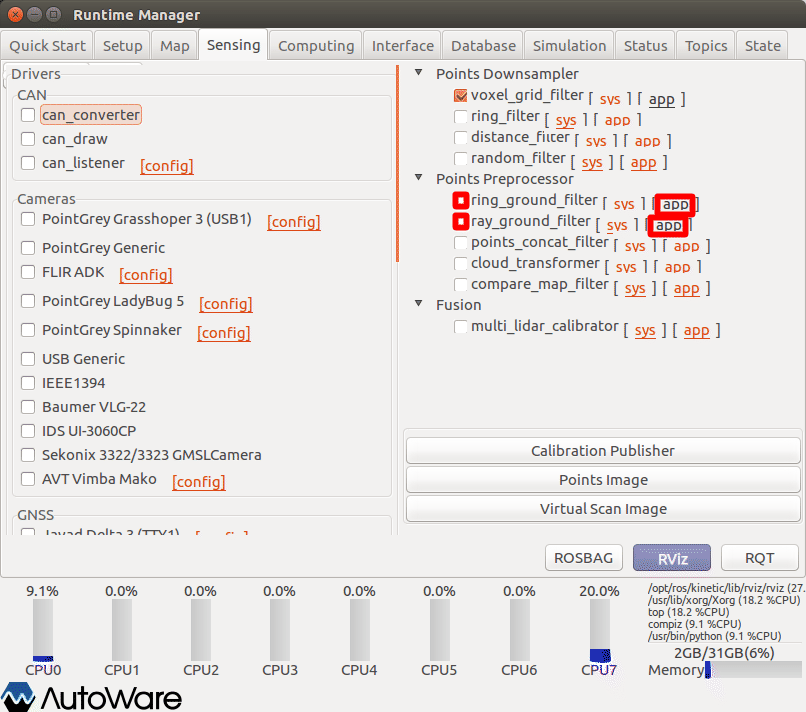
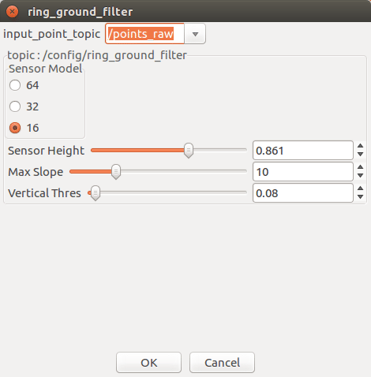
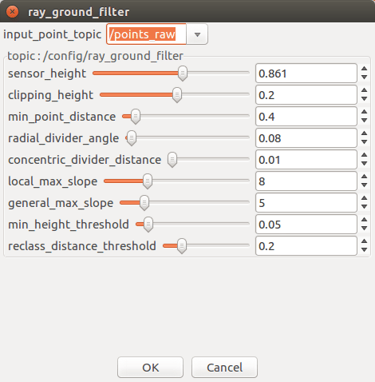
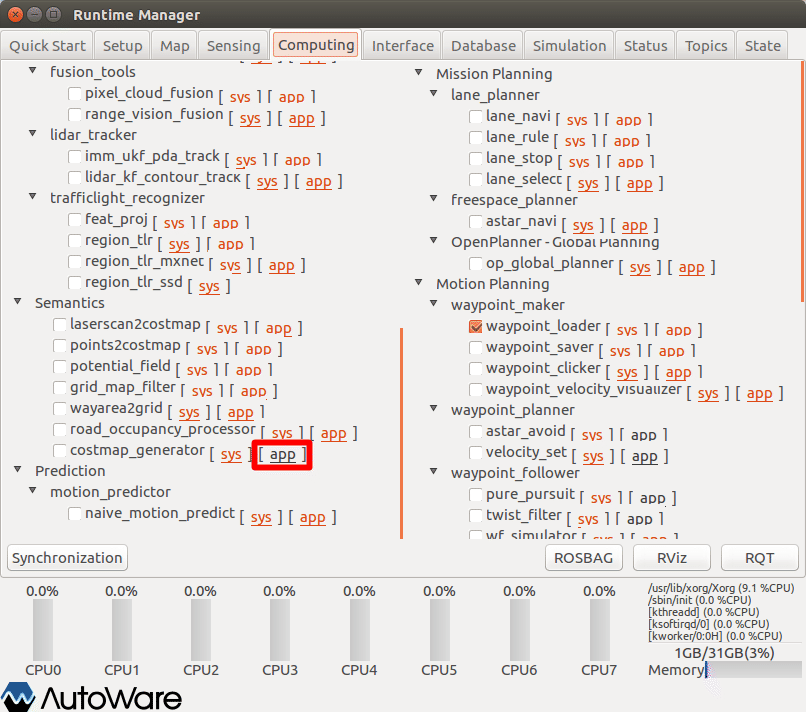
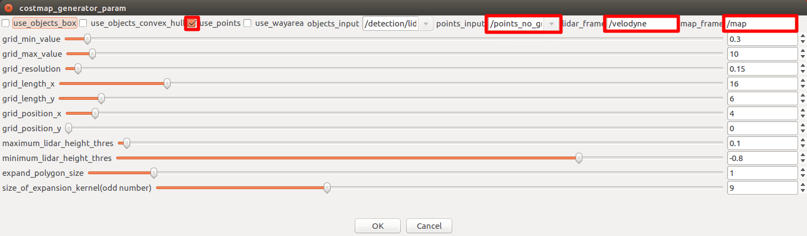
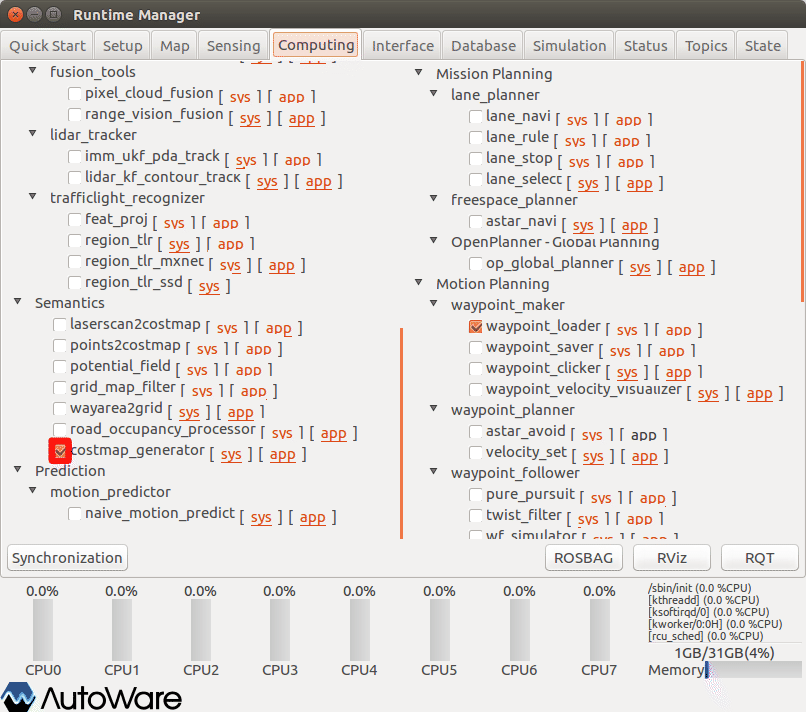
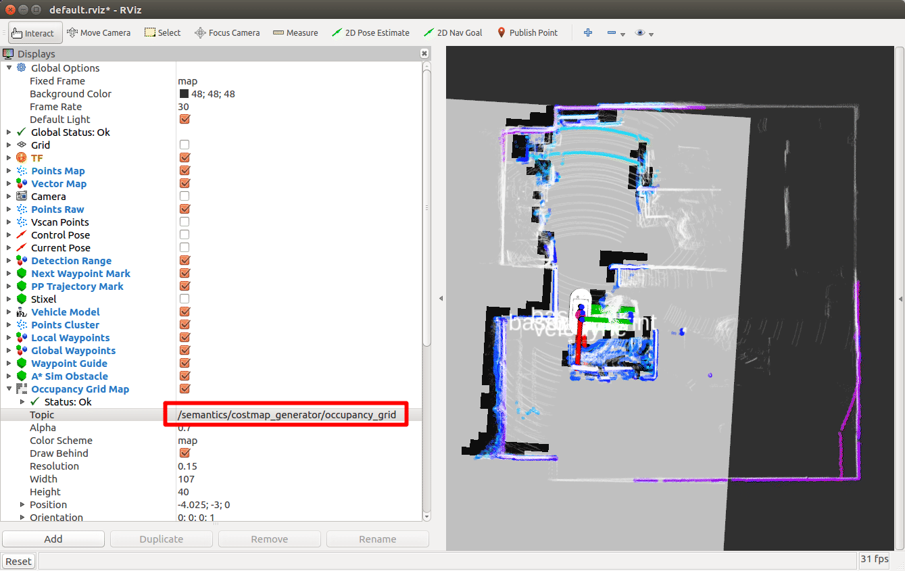
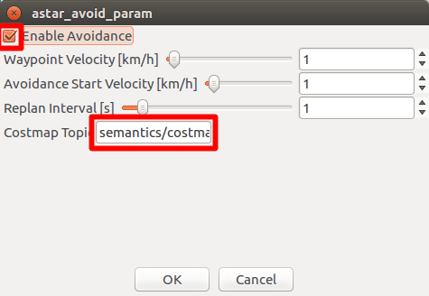
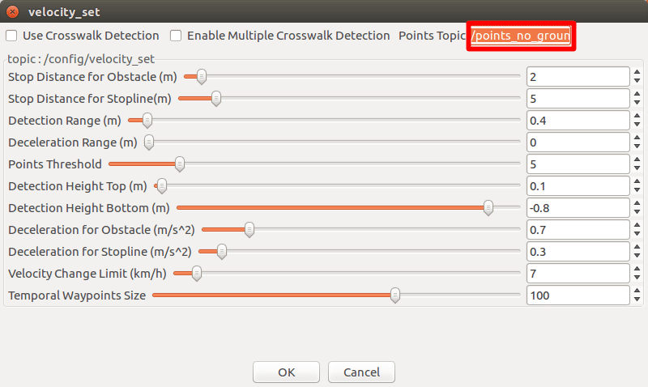

# 10.経路の自動走行（障害物回避）

作成した経路設定（waypoint）ファイルに従い自動走行を行う方法を以下に示す。

本内容は、障害物検知した場合には、ゴールまでの障害物回避ルートを検索する。回避ルートが見つからない場合は一定の距離で停止することを目的としている。

## 事前準備

事前に以下の準備をしておくこと。

### 準備1

Autoware関連launchファイルの設定

#### ・velocity_set

障害物として検知しない距離の設定を行う。（無視する半径）

AGV本体（車体）を障害物として検知しないよう設定する。

| 項目       | 内容                                                         | 備考   |
| ---------- | ------------------------------------------------------------ | ------ |
| ファイル名 | velocity_set.launch                                          | -      |
| 格納先     | ~/Autoware/ros/install/waypoint_planner/share/waypoint_planner/launch | 1.11.1 |
| 〃         | ~/Autoware/ros/src/computing/planning/motion/packages/astar_planner/launch | 1.10.0 |

変更内容については前章参照の事。


#### ・aster_aviod

障害物検知時の回避ルート検索の設定を行う。

| 項目       | 内容                                                         | 備考   |
| ---------- | ------------------------------------------------------------ | ------ |
| ファイル名 | aster_avoid.launch（obstacle_avoid.launch）                  | -      |
| 格納先     | ~/Autoware/ros/install/waypoint_planner/share/waypoint_planner/launch | 1.11.1 |
| 〃         | ~/Autoware/ros/src/computing/planning/motion/packages/astar_planner/launch | 1.10.0 |


変更内容

```xml
<launch>

  <!-- Relay behavior configurations -->
  <arg name="safety_waypoints_size" default="100" />
  <arg name="update_rate" default="10" />

  <!-- Avoidance behavior configurations -->
  <arg name="costmap_topic" default="semantics/costmap_generator/occupancy_grid" />
  <arg name="enable_avoidance" default="false" />
  <arg name="avoid_waypoints_velocity" default="10.0" />
  <arg name="avoid_start_velocity" default="3.0" />
  <arg name="replan_interval" default="2.0" />
  <arg name="search_waypoints_size" default="25" />
  <arg name="search_waypoints_delta" default="1" />

  <!-- A* search configurations -->
  <arg name="use_back" default="false" />
  <arg name="use_potential_heuristic" default="true" />
  <arg name="use_wavefront_heuristic" default="false" />
  <arg name="time_limit" default="1000.0" />
  
  
  <arg name="robot_length" default="1.157" />
            ↑ smagv 0.890＊1.3＝1.157 （defaulf:4.5）
  <arg name="robot_width" default="1.000" />
            ↑ smagv 0.430  velocity_set(Detection Range)＊2＝1.000（defaulf:1.75）
  <arg name="robot_base2back" default="0.439" />
            ↑ smagv 0.338＊1.3＝0.439 （defaulf:4.5）
  <arg name="minimum_turning_radius" default="1.35" />
            ↑ smagv 回転直径1.35m 半径を設定すると動作不安定のため直径設定（調整中）  （defaulf:4.5）
  <arg name="theta_size" default="48" />
  <arg name="curve_weight" default="1.2" />
  <arg name="reverse_weight" default="2.00" />
  <arg name="lateral_goal_range" default="0.2" />
  <arg name="longitudinal_goal_range" default="0.3" />
  <arg name="angle_goal_range" default="6.0" />
  <arg name="obstacle_threshold" default="100" />
  <arg name="potential_weight" default="10.0" />
  <arg name="distance_heuristic_weight" default="1.00" />

  <node pkg="waypoint_planner" type="astar_avoid" name="astar_avoid" output="screen">
     ：
  </node>

</launch>

```


|  #   | 種類           | 項目                      | 内容                                                         | 単位 | SMAGV妥当値 | 備考 |
| :--: | -------------- | ------------------------- | ------------------------------------------------------------ | :--: | ----------- | ---- |
|  1   | 検索方法       | use_potential_heuristic   | costmapに車体がかからないようにするサーチ方法                |  -   | true        |      |
|  2   | ↑              | use_wavefront_heuristic   | 波面サーチ                                                   |  -   | false       |      |
|  3   | ロボット緒元   | robot_length              | 車体長さ                                                     |  m   | 1.157       | ※    |
|  4   | ↑              | robot_width               | 車幅                                                         |  m   | 1.000       | ※    |
|  5   | ↑              | robot_base2back           | 車体後端からのbase_linkの距離                                |  m   | 0.439       | ※    |
|  6   | ↑              | minimum_turning_radius    | 最小旋回半径                                                 |  m   | 1.35        | ※    |
|  7   | ルート検索設定 | use_back                  | 後退するルートの検索可否                                     |  -   | false       |      |
|  8   | ↑              | theta_size                | リルート時最大舵角                                           |  度  | 48          |      |
|  9   | ↑              | curve_weight              | 未使用                                                       |  -   | 1.2         |      |
|  10  | ↑              | reverse_weight            |                                                              |  -   | 2.00        |      |
|  11  | ↑              | lateral_goal_range        | 横方向の目標範囲                                             |  m   | 0.2         |      |
|  12  | ↑              | longitudinal_goal_range   | 縦方向の目標範囲                                             |  m   | 0.3         |      |
|  13  | ↑              | angle_goal_range          | 角度目標範囲                                                 |  度  | 6.0         |      |
|  14  | ↑              | obstacle_threshold        | 障害物認識のしきい値                                         |  -   | 100         |      |
|  15  | ↑              | potential_weight          | costの嵩上げ（乗数）                                         |  -   | 10.0        |      |
|  16  | ↑              | distance_heuristic_weight | 障害物との距離計算時の比重（乗数）（小さくすると余裕間隔が増える?） |  -   | 1.00        |      |

※実際のロボットのサイズより大きくすることで、リルート時に障害物との間隔を確保する。特に車幅に関しては転回することも考慮し、velocity_set－「Detection Range」項目と合わせて設定すること。


設定した内容は、Runtime Manager［Computing］タブ－［aster_aviod］項目のチェックBOXを「チェックあり」にした時に反映する。反映がうまくいかない場合は、Autowareの再起動を行う。


### 準備2

その他、以下の準備をしておくこと。

- velodyne、SMAGVの起動。
- AGVの自己位置推定設定。


## groundトピックの発行設定

地面（points_ground）と地面以外（points_no_ground）を判断するためのトピックを発行する。

以下のいずれかを実施する。（どちらが良いかは？「ray_ground_filter」の方が精度が高い？）




### ring_ground_filter

点群のリング形状のものを地面として検出する方法？



設定値は調整中。

|  #   | 項目               | 内容           | SMAGV妥当値 | Logiee妥当値 | Thouzer妥当値 |
| :--: | ------------------ | -------------- | ----------- | ------------ | ------------- |
|  1   | input_points_topic | 入力トピック名 | /points_raw | ←            | ←             |
|  2   | Sensor Model       | センサーモデル | 16          | ←            | ←             |
|  3   | Sensor Height      | センサー高さ   | 0.965       | 0.32         | 0.91          |
|  4   | Max Slope          |                |             |              |               |
|  5   | Vertical Thres     |                |             |              |               |


### ray_ground_filter

放射状の同心円を地面として検出する方法？



設定値は調整中。

|  #   | 項目               | 内容           | SMAGV妥当値 | Logiee妥当値 | Thouzer妥当値 |
| :--: | ------------------ | -------------- | ----------- | ------------ | ------------- |
|  1   | input_points_topic | 入力トピック名 | /points_raw | ←            | ←             |
|  3   | Sensor Height      | センサー高さ   | 0.965       | 0.32         | 0.91          |
|  2   | Clipping Height    | 有効高さ       | 0.2         |              |               |
|  4   | min_point_distance | 最小有効距離   | 0.4         |              |               |
|  5   |                    |                |             |              |               |


## AGVの推定姿勢・速度算出の設定

AGVの推定姿勢・速度算出のため、｢vel_pose_connect｣を設定し、チェックありにする。

詳細は前章参照のこと。


## waypoint_loaderの設定

waypointファイルの読み込み設定をする。

詳細は前章参照のこと。

1. waypoint_loaderパラメタ項目を適宜設定する。
2. ［OK］ボタン押下で前画面に戻る。
3. waypoint_loader項目チェックBOXをチェックありにする。


## costmapの設定と確認

### costmap_generatorの設定

障害物を検出するための設定をする。

以下、costmap_generator項目を設定する。



1. costmap_generator項目［app］押下でパラメタ設定画面を表示する。




1. costmap_generatorパラメタ項目を適宜設定する。
2. ［OK］ボタン押下で前画面に戻る。

　

パラメタには以降の章で説明する物体検出データを利用する。どの物体検出データを利用するかは適宜検討の事。

|  #   | 項目名         | 内容 | 単位 |    SMAGV妥当値    | 備考 |
| :--: | -------------- | ---- | :--: | :---------------: | ---- |
|  1   | use_object_box |      |      |   チェックあり    | -    |
|  2   | use_points     |      |      |   チェックあり    | ※    |
|  3   | objects_input  |      |      |       任意        | ※    |
|  4   | points_input   |      |      | /points_no_ground |      |
|  5   | lide_frame     |      |      |     /velodyne     |      |
|  6   | map_frame      |      |      |       /map        |      |
|  7   | その他検討中   |      |      |                   |      |
|      |                |      |      |                   |      |


※チェックありの場合は以下のいずれかを選択

- 章12.点群からのクラスタリングオブジェクト（/detection/lidar_detector/objects）（処理が軽いのでお勧め）
- 章13.画像からのクラスタリングオブジェクト（/detection/image_detector/objects）
- 章14.センサフュージョンオブジェクト（/detection/fusion_tools/objects）
- 章15.クラスタトラッキングオブジェクト（/detection/object_tracker/objects）





1. costmap_generator項目チェックBOXをチェックありにする。

### costmapの確認

1. RViz起動後、defaultのRViz設定ファイルを開く。（~/Autoware/ros/src/.config/rviz/default.rviz）




1. Occupancy Grid Map項目の表示トピックを「/semantics/costmap_generator/occupancy_grid」に変更する。
2. RViz右フレームにcosmapが表示されることを確認する。


## waypoint_planner（astar_planner）項目の設定

以下、waypoint_planner項目を設定する。（Autowareバージョンによっては、「astar_planner」となっている場合があるので読み替えのこと。）

### aster_avoid（obstacle_avoid）の設定

経路上の障害物に対して回避経路を生成するための設定をする。

・aster_avoid項目［app］押下でパラメタ設定画面を表示する。



1. 「Enable Avoidance」をチェックありにする。
2. 「Costmap Topic」を「semantics/costmap_generator/occupancy_grid」にする。
3. その他のパラメタについては前章参照の事。
4. ［OK］ボタン押下で前画面に戻る。
5. aster_avoid項目チェックBOXをチェックありにする。


### velocity_setの設定

経路上の物体を検出し、最終的な速度を決定するための設定をする。



1. velocity_set項目［app］押下でパラメタ設定画面を表示する。
2. 「Points Topic」を「/points_no_ground」にする。
3. その他のパラメタについては前章参照の事
4. ［OK］ボタン押下で前画面に戻る。
5. velocity_set項目チェックBOXをチェックありにする。


## waypoint_follower項目の設定

以下、waypoint_follower項目を設定する。（Autowareバージョンによっては、項目の位置が異なる場合がある。）

### pure_pursuitの設定

自己位置から目標位置までの曲率（滑らかなカーブにする）を求めるためのアルゴリズムの設定をする。詳細は前章参照のこと。

2. pure_pursuit項目［app］押下でパラメタ設定画面を表示する。
2. pure_pursuitパラメタ項目を適宜設定する。
3. ［OK］ボタン押下で前画面に戻る。
4. pure_pursuit項目チェックBOXをチェックありにする。


### twist_filterの設定

自己位置から目標位置までの曲率を求めるためのアルゴリズムの設定をする。詳細は前章参照のこと。

1. twist_filter項目［app］押下でパラメタ設定画面を表示する。
2. twist_filterパラメタ項目を適宜設定する。
3. ［OK］ボタン押下で前画面に戻る。
4. twist_filter項目チェックBOXをチェックありにする。


## lane_planner項目の設定

以下、lane_planner項目を設定する。

1. lane_rule項目チェックBOXをチェックありにする。
2. lane_stop項目チェックBOXをチェックありにする。
3. lane_select項目チェックBOXをチェックありにする。


## 障害物回避ルートの確認

waypointルート上に障害物を設置したとき、回避ルートが生成されることを確認する。

別ターミナルウィンドウに「 [ERROR] [xxxxxxxxxxxxx.xxxxxxxxxxx]: Can't find goal... 」を表示していない事を確認する。


## SMAGVの自動運転切り替え

別ターミナルウィンドウに「 [ERROR] [xxxxxxxxxxxxx.xxxxxxxxxxx]: Can't find goal... 」を表示していない場合は、Bluetoothゲームパッドの［Y］ボタン押下で自動走行モードに切り替え、AGVが自動走行することを確認する。

<u>**※走行中に回避ルートを見失った場合、障害物を考慮せずwaypointに従い走行するので、常に非常停止できる準備をしておくこと**</u>


## その他

別ターミナルウィンドウに「[ERROR] [xxxxxxxxxxxxx.xxxxxxxxxxx]: Can't find goal...」を表示している場合や、車体が停止する場合は、以下の原因が考えられる。

| #    | 原因                                                         | 対策                                                         |
| ---- | ------------------------------------------------------------ | ------------------------------------------------------------ |
| 1    | 車体が通過できる物理的なスペースがない。                     | 車体が通過できるスペースを確保する。                         |
| 2    | Lider設置高さと障害物の高さの影響によるもの。                | 障害物の高さをLider設置高さ以上にする。                      |
| 3    | velocity_set－「Detection Range」項目の範囲内に障害物がある。 | velocity_set－「Detection Range」設定値の見直し。            |
| 4    | ↑                                                            | aster_avoid.launch（obstacle_avoid.launch）のロボット緒元に係る項目の見直し。 |
| 5    | costmapの障害物認識サイズの粗密が妥当でない。                | costmap_generator項目－「grid_resolution」設定値の見直し     |
| 6    | costmap算出に係る所要時間による遅延（処理が重い）。          | costmap_generator項目－「grid_length_x」「grid_length_y」設定値の見直し。cosmap全体のサイズを小さくすることで検索範囲を狭める。 |

