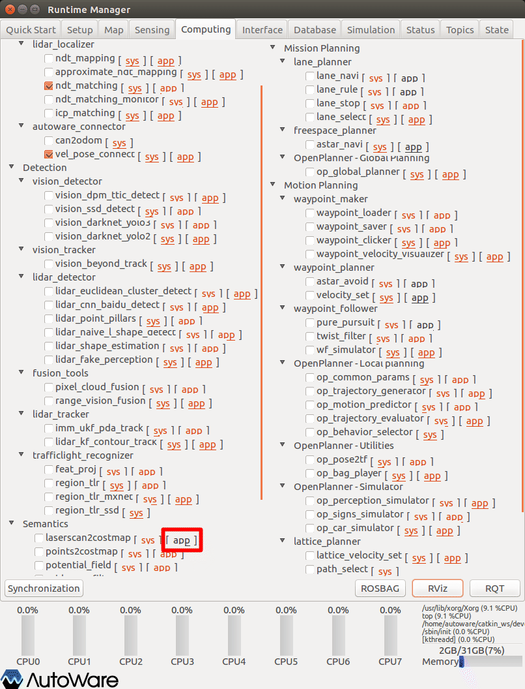
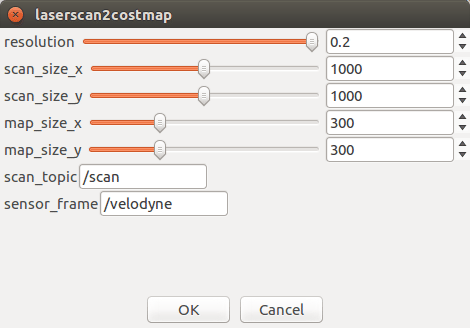
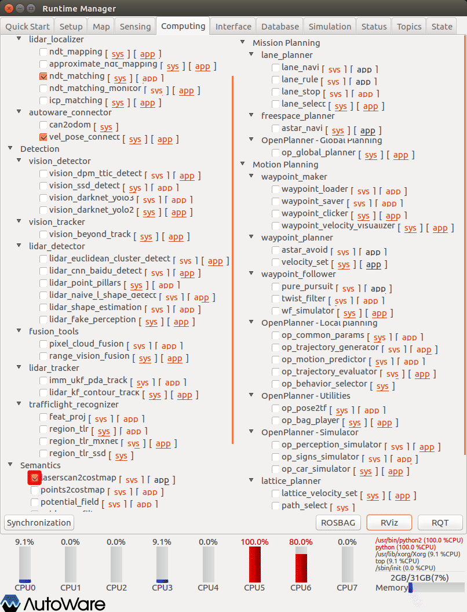
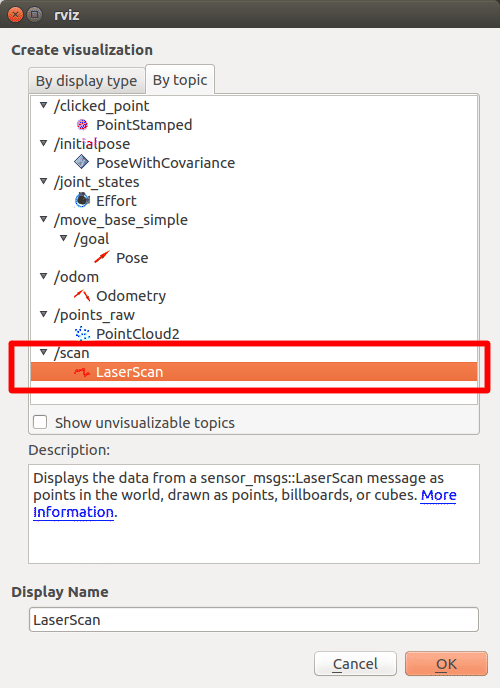
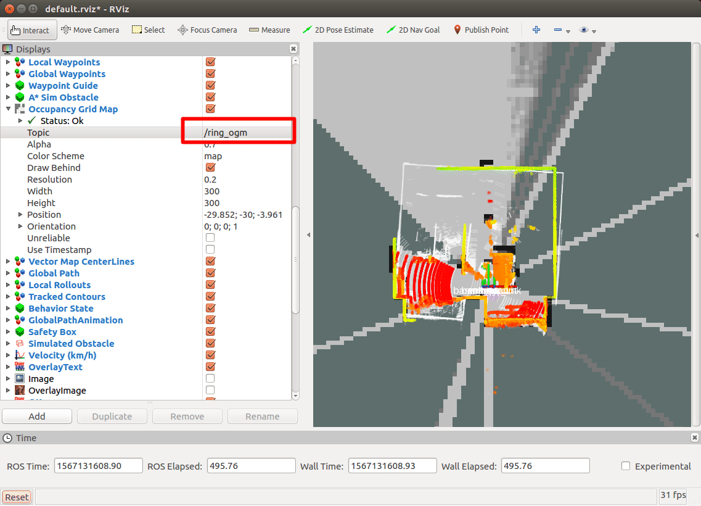
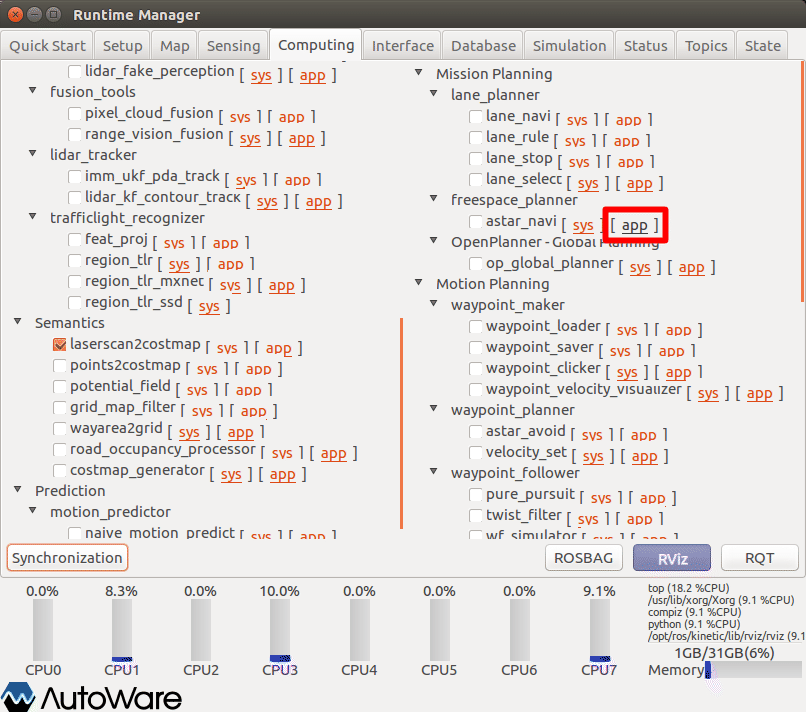
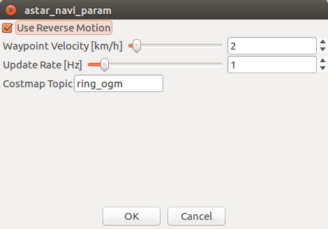
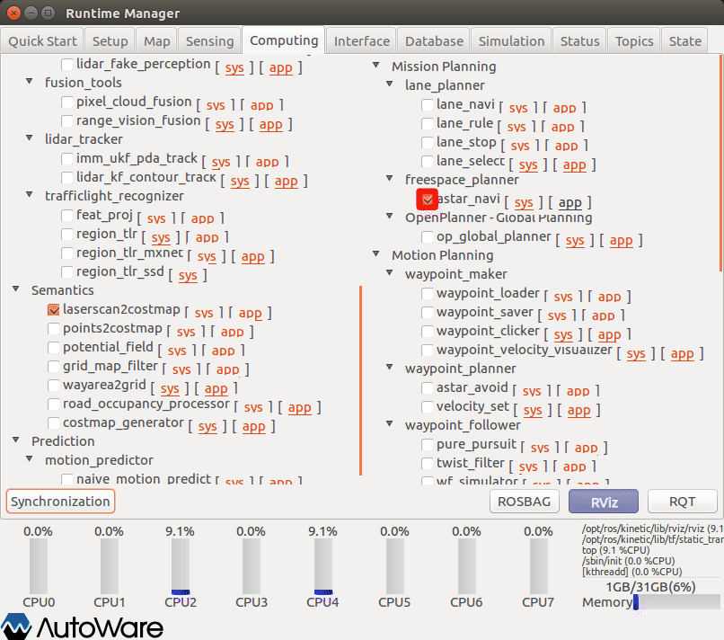
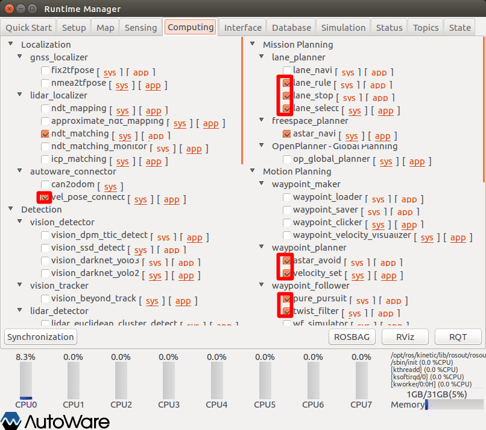
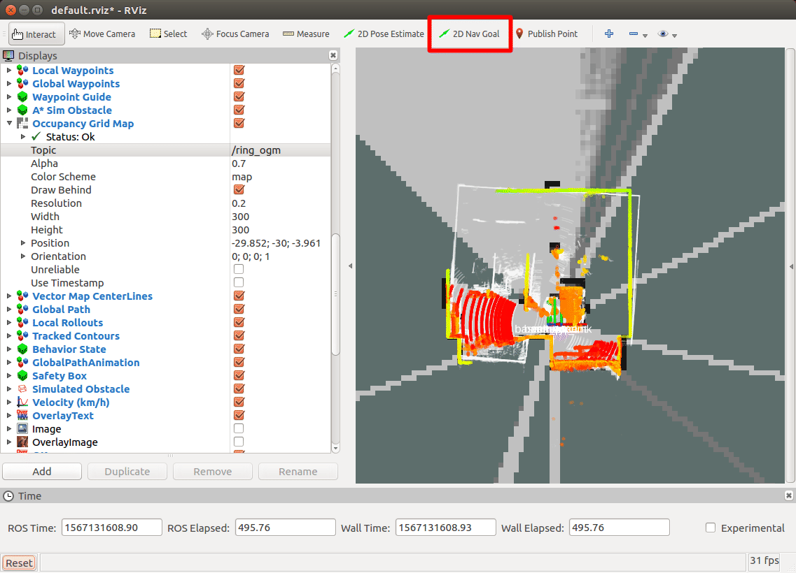

# 11.自動経路生成（駐車経路生成）

Autowareによる自動経路生成（駐車経路生成）方法を以下に示す。

作業前の情報を初期化するため、念のためAutowareを再起動する。

※設定詳細は、「Autoware 自動運転ソフトウェア入門」P164参照


## 事前準備

事前に以下の準備をしておくこと。

### 準備1

#### velodyneモジュールの変更

「Autoware 自動運転ソフトウェア入門」では、「points2vscan」機能により「/scan」トピックを生成しているが、本書では、velodyneの機能により「/scan」トピックをパブリッシュする手順とする。ただし、一部velodyneモジュールの変更を行う。

※北陽Liderセンサーと併用すると制御が不安定になるので、排他使用を推奨。北陽Liderセンサーによる「/scan」トピックについての説明については省略する。（ name_space 、その他駆使すれば可能と思うが煩雑になるので...）


##### 変更概要

velodyneモジュールは、pointsトピックの他に「/scan」トピックもパブリッシュしている。ただし、pointsトピック名が「velodyne_points」の場合に限り、「/scan」トピックに有効データがセットされる仕様である。Autowareでは、固定のトピック名「points_raw」で機能を実現している部分もあり、現状では設定が煩雑化するため、トピック名「points_raw」の場合に「/scan」トピックに有効データをセットするよう変更する。

（ただし、北陽Liderセンサーを利用する場合は、この限りではない。）


##### ソース修正

| 項目         | 内容                                             | 備考   |
| ------------ | ------------------------------------------------ | ------ |
| 格納フォルダ | ~/catkin_ws/src/velodyne/velodyne_laserscan/src/ | -      |
| ファイル名   | velodyne_laserscan.cpp                           | 57行目 |


```c++
void VelodyneLaserScan::connectCb()
{
  boost::lock_guard<boost::mutex> lock(connect_mutex_);
  if (!pub_.getNumSubscribers())
  {
    sub_.shutdown();
  }
  else if (!sub_)
  {
    sub_ = nh_.subscribe("velodyne_points", 10, &VelodyneLaserScan::recvCallback, this);
                           ↑ここを ｢velodyne_points｣ → ｢points_raw｣に変更
  }
}
```


##### ビルド

ソース修正後ビルドを行う。


### 準備2

#### Autoware関連launchファイルの変更

AGV本体（車体）の緒元を設定する。

| 項目       | 内容                                                         | 備考   |
| ---------- | ------------------------------------------------------------ | ------ |
| ファイル名 | astar_navi.launch                                            | -      |
| 格納先     | ~/Autoware/ros/install/freespace_planner/share/freespace_planner/launch | 1.11.1 |
| 〃         | ~/Autoware/ros/src/computing/planning/mission/packages/freespace_planner/launch | 1.10.0 |


変更内容（設定内容については現在調整中（バージョンごとで内容が異なる））

※複数行コメントや日本語を使用すると、取込みエラーになることがあるので使用しないこと

```xml
<launch>

  <!-- Navi configurations -->
  <arg name="costmap_topic" default="semantics/costmap_generator/occupancy_grid" />
  <arg name="waypoints_velocity" default="5.0" />
  <arg name="update_rate" default="1.0" />

  <!-- A* search configurations -->
  <arg name="use_back" default="true" />
  <arg name="use_potential_heuristic" default="true" />
  <arg name="use_wavefront_heuristic" default="false" />
  <arg name="time_limit" default="5000.0" />
  <arg name="robot_length" default="0.89" /><!-- 車体長さ default:4.5 -->
  <arg name="robot_width" default="0.41" /><!-- 車幅 default:1.75 -->
  <arg name="robot_base2back" default="1.0" />
  <arg name="minimum_turning_radius" default="1.0" /><!-- 最小回転半？直？径 default:6.0 -->
  <arg name="theta_size" default="48" /><!-- 経路検索時の角度 -->
  <arg name="curve_weight" default="1.2" />
  <arg name="reverse_weight" default="2.00" />
  <arg name="lateral_goal_range" default="0.5" /><!-- ゴールの許容範囲（横）？(m) default:0.5 -->
  <arg name="longitudinal_goal_range" default="0.4" /><!-- ゴールの許容範囲（縦）？(m) default:2.0 -->
  <arg name="angle_goal_range" default="6.0" /><!-- ゴールの許容範囲（角度）？(度) default:6.0 -->
  <arg name="obstacle_threshold" default="100" />
  <arg name="potential_weight" default="10.0" />
  <arg name="distance_heuristic_weight" default="1.0" />

  <node pkg="freespace_planner" type="astar_navi" name="astar_navi" output="screen">
    <remap from="costmap" to="$(arg costmap_topic)" />
    <param name="waypoints_velocity" value="$(arg waypoints_velocity)" />
    <param name="update_rate" value="$(arg update_rate)" />

    <param name="use_back" value="$(arg use_back)" />
    <param name="use_potential_heuristic" value="$(arg use_potential_heuristic)" />
    <param name="use_wavefront_heuristic" value="$(arg use_wavefront_heuristic)" />
    <param name="time_limit" value="$(arg time_limit)" />
    <param name="robot_length" value="$(arg robot_length)" />
    <param name="robot_width" value="$(arg robot_width)" />
    <param name="robot_base2back" value="$(arg robot_base2back)" />
    <param name="minimum_turning_radius" value="$(arg minimum_turning_radius)" />
    <param name="theta_size" value="$(arg theta_size)" />
    <param name="angle_goal_range" value="$(arg angle_goal_range)" />
    <param name="curve_weight" value="$(arg curve_weight)" />
    <param name="reverse_weight" value="$(arg reverse_weight)" />
    <param name="lateral_goal_range" value="$(arg lateral_goal_range)" />
    <param name="longitudinal_goal_range" value="$(arg longitudinal_goal_range)" />
    <param name="obstacle_threshold" value="$(arg obstacle_threshold)" />
    <param name="potential_weight" value="$(arg potential_weight)" />
    <param name="distance_heuristic_weight" value="$(arg distance_heuristic_weight)" />
  </node>

  <!-- Visualization node-->
  <node pkg="waypoint_maker" type="waypoint_marker_publisher" name="waypoint_marker_publisher" />

</launch>
```


### 準備3

その他、以下の準備をしておくこと。

- velodyne、SMAGVの起動。
- AGVの自己位置推定設定。


## コストマップの生成

レーザスキャン情報からコストマップを生成する。

laserscan2costmap項目の設定をする。



1. Runtime Managerの［Computing］タブを選択。
2. laserscan2costmap項目［app］押下でパラメタ設定画面を表示する。




1. laserscan2costmapパラメタ項目を適宜設定する。
2. ［OK］ボタン押下で前画面に戻る。


|  #   | 項目名       | 内容                                         | 単位 | smagv妥当値                                 |
| :--: | ------------ | -------------------------------------------- | :--: | ------------------------------------------- |
|  1   | Resolution   | 解像度                                       |      | 0.05                                        |
|  2   | scan_size_x  |                                              |      | 1000                                        |
|  3   | scan_size_y  |                                              |      | 1000                                        |
|  4   | map_size_x   |                                              |      | 500                                         |
|  5   | map_size_y   |                                              |      | 500                                         |
|  6   | scan_topic   | Laser Scanトピック名                         |  -   | /scan                                       |
|  7   | sensor_frame | センサフレーム名（urdf、TF定義名を設定する） |  -   | /velodyne（veodyne） /base_2d_laser（北陽） |




1. laserscan2costmap項目チェックBOXをチェックありにする。


## RVizの設定

RViz起動後、defaultのRViz設定ファイルを開く。（~/Autoware/ros/src/.config/rviz/default.rviz）

その後、以下topic表示を追加する。


- ［add］押下で追加トピック選択画面を表示する。




1. 追加トピック選択画面の［by topic］タブを選択。
2. ［/scan］トピックの［LaserScan］を選択する。
3. ［OK］ボタン押下で確定する。
4. LaserScan表示がされていることを確認する。（points_rawと表示色が似ているので、適宜調整する）




1. Occupancy Grid Map項目の表示トピックを［/ring_ogm］に変更する。
2. 右フレームにcosmapが表示されることを確認する。（velodyneと北陽Liderを併用していると、costmapを表示しないので、Liderは排他使用にする。）


## 経路生成

経路を生成するための設定を行う。

astar_navi項目の設定をする。



1. Runtime Managerの［Computing］タブを選択。
2. astar_navi項目［app］押下でパラメタ設定画面を表示する。




1. astar_naviパラメタ項目を適宜設定する。
2. ［OK］ボタン押下で前画面に戻る。


|  #   | 項目名             | 内容                              | 単位 | smagv妥当値 |
| :--: | ------------------ | --------------------------------- | :--: | ----------- |
|  1   | Use Reverse Motion | 車庫入れ時の切り返し経路生成 有無 |  -   |             |
|  2   | Waypoint Velocity  | 速度                              | km/h |             |
|  3   | Update Rate        | 更新間隔                          |  Hz  |             |
|  4   | costmap topic      | costmapのトピック名               |  -   | ring_ogm    |




1. astar_navi項目チェックBOXをチェックありにする。




1. lane_rule項目チェックBOXをチェックありにする。
2. lane_stop項目チェックBOXをチェックありにする。
3. lane_select項目チェックBOXをチェックありにする。
4. vel_pose_connect項目チェックBOXをチェックありにする。
5. aster_avoid項目チェックBOXをチェックありにする。
6. velocity_set項目チェックBOXをチェックありにする。
7. pure_pursuit項目チェックBOXをチェックありにする。
8. twist_filter項目チェックBOXをチェックありにする。


## ゴール位置指定

Rviz表示に切り替え、ゴール位置を指定する。



1. Rvizツールバーの［2D Nav Goal］に押下する。
2. 右フレーム（マップフレーム）にマウスでゴール位置を設定する（カーソルをゴール地点にし、左クリック。左クリックしたままの状態で、マウスを移動し向きを指定する。その後、マウス左ボタンを離す。）
3. waypointが、地図上に表示されることを確認する。（agv本体を移動しないと表示しない場合があるのでその場合は、少し移動してみる）


## SMAGVの自動運転切り替え

Bluetoothゲームパッドの［Y］ボタン押下で自動走行モードに切り替え、AGVが自動走行することを確認する。


## その他

- 特になし

