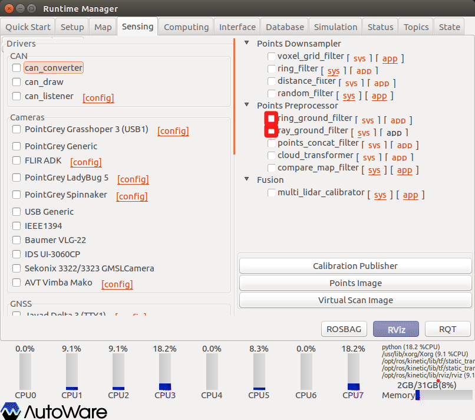
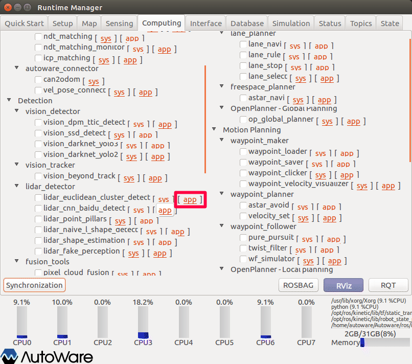
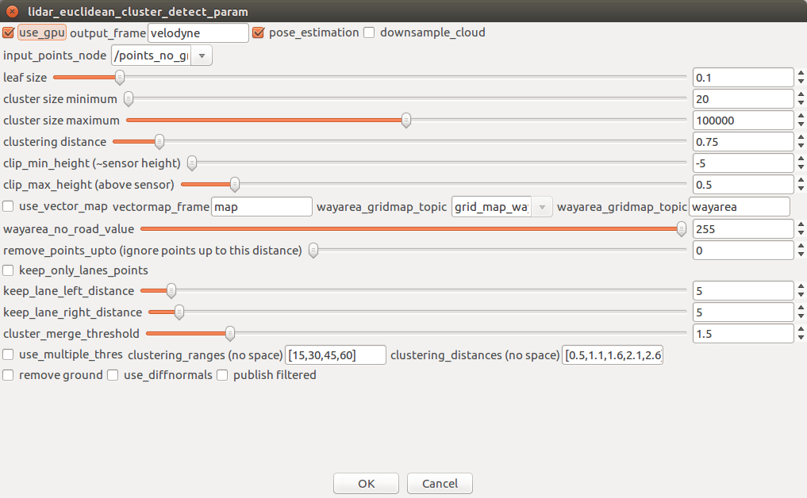
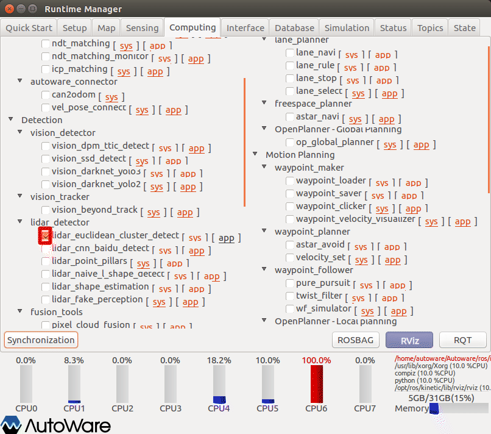
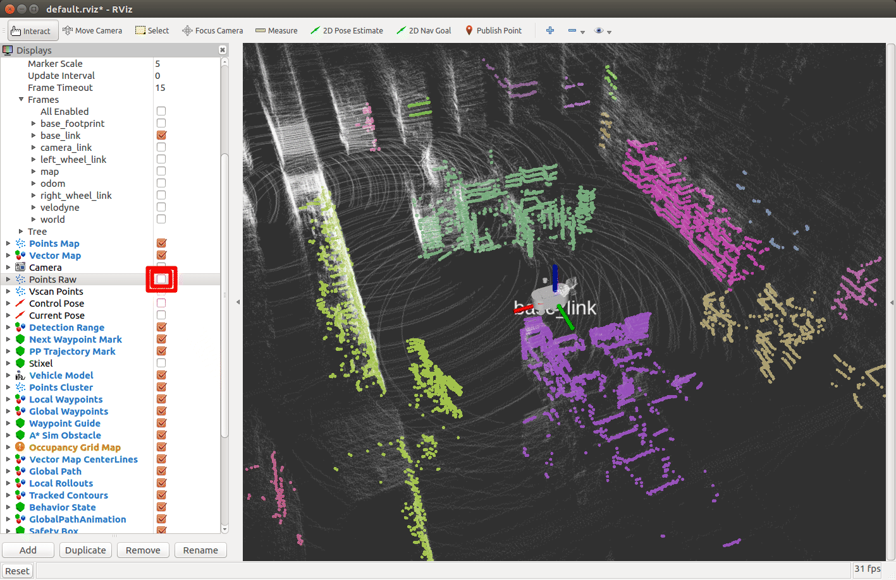

# 12.物体検出（点群からのクラスタリング）

点群を使った物体検出方法を以下に示す。

※設定詳細は、「Autoware 自動運転ソフトウェア入門」P121参照

## 事前準備

事前に以下の準備をしておくこと。

### 準備1

groundトピックの発行設定を行う。（以下いずれかをチェックする。）

内容については、10章参照のこと。

### 準備2

以下のいずれかを準備しておくこと。

- velodyne、SMAGVの起動
- ROSBAG再生の一時停止

## 点群クラスタの生成

レーザスキャン情報からクラスタを生成する。

lider_euclidean_cluster_detect項目の設定をする。

1. Runtime Managerの［Computing］タブを選択。
2. lider_euclidean_cluster_detect項目［app］押下でパラメタ設定画面を表示する。

1. lider_euclidean_cluster_detectパラメタ項目を適宜設定する。
2. ［OK］ボタン押下で前画面に戻る。

|  #   | 項目名            | 内容                                       | 単位 | smagv妥当値       |
| :--: | ----------------- | ------------------------------------------ | :--: | ----------------- |
|  1   | use_gpu           | GPU使用 有無                               |  -   | チェックあり      |
|  2   | output_frame      | フレーム名                                 |  -   | velodyne          |
|  3   | pose_estimation   | 姿勢推定の有無？                           |  -   | チェックあり      |
|  4   | map_size_x        | ポイントデータの間引き 有無？              |  -   | チェックなし      |
|  5   | input_points_node | Laser Scanトピック名                       |  -   | /points_no_ground |
|  6   | Leaf Size         | スキャンデータのダウンサンプリングサイズ。 |  m   | 0.1               |
|  7   | 調整中            |                                            |      |                   |

1. lider_euclidean_cluster_detect項目チェックBOXをチェックありにする。

## RVizの設定

RViz起動後、defaultのRViz設定ファイルを開く。（~/Autoware/ros/src/.config/rviz/default.rviz）

そのままでは、Points_rawトピックとPoints_clusterトピックが同時に表示されており、判別しづらいのでPoints_rawトピックを非表示にする。

- クラスタリング表示がされていることを確認する。

点群に各クラスタを示す色が表示される。**同じ色の部分が同じクラスタに属し**ており、1つの物体として検出される。

## その他

- ROSBAG再生を一時停止している場合は、再生再開をする。
- 正しく表示しない場合、RVizの［Displays］ウィンドウ－［Global Options］－［Fixed Frame］を見直す。