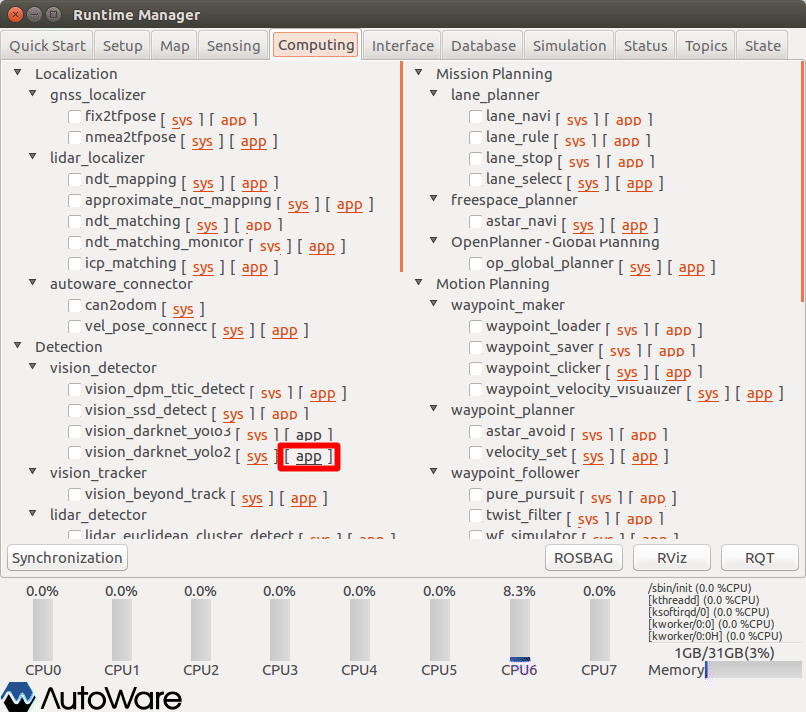
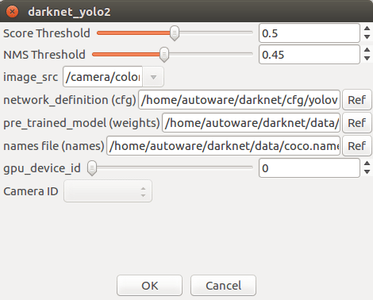
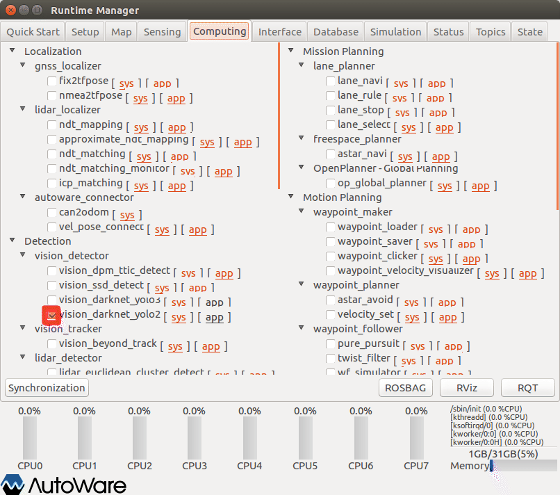
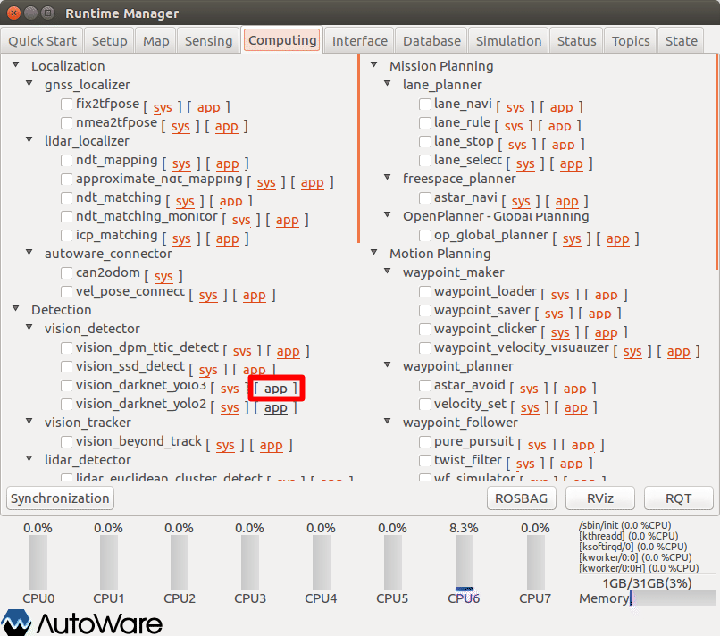
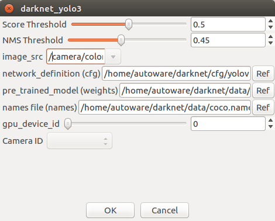
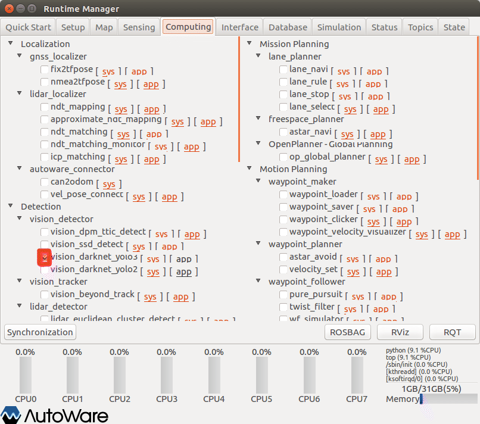
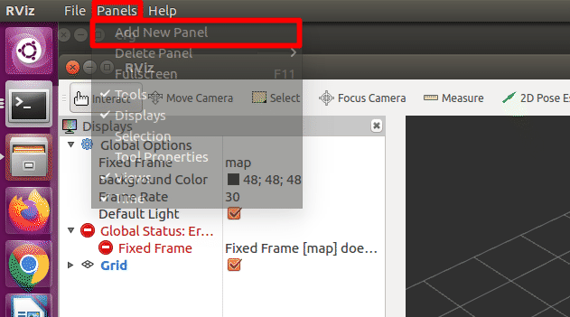
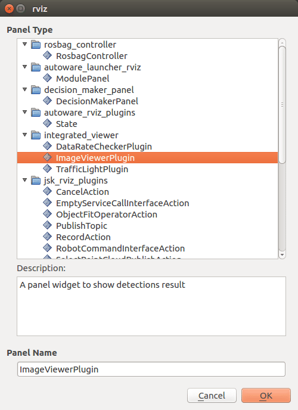
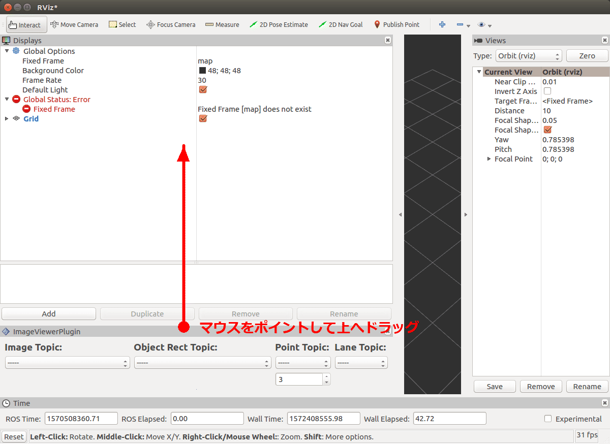
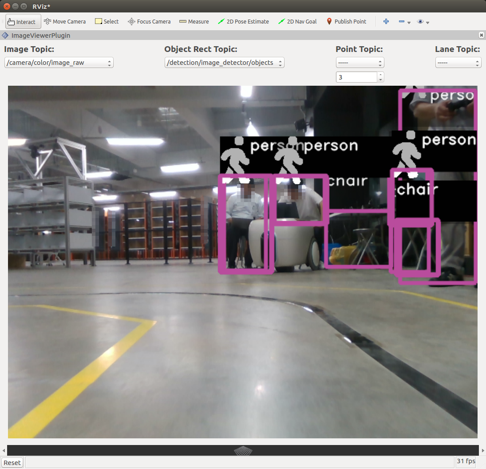

# 13.物体検出（画像からのクラスタリング）

画像を使った物体検出方法を以下に示す。

※設定詳細は、「Autoware 自動運転ソフトウェア入門」P124参照


## 事前準備

事前に以下の準備をしておくこと。

### 準備1

YOLO（You Look Only Onse「リアルタイムオブジェクト検出アルゴリズム」）パラメタのダウンロードを行う。

#### darknet 共通ファイルのダウンロード

モジュール本体も同時にダウンロードされるが、本書では、Autoware 内のモジュールを使用するため、パラメタのみ利用する。

```command
$ cd
$ git clone https://github.com/pjreddie/darknet.git
```


#### 学習済みのウェイト（パラメータ）ファイルのダウンロード 

```command
$ cd ~/darknet/data
$ wget http://pjreddie.com/media/files/yolov2.weights	← YOLO V2用
$ wget http://pjreddie.com/media/files/yolov3.weights	← YOLO V3用
```


### 準備2

以下のいずれかを準備しておくこと。

- velodyne、SMAGVの起動
- ROSBAG再生の一時停止


## 物体検出アルゴリズムの起動

以下のいずれかを行う。（通常は予測率の高い「YOLO v3」でよい）

### SSDの起動

vision_ssd_detect項目の設定をする。

内容は省略


### YOLO v2の起動

vision_darknet_yolo2項目の設定をする。



1. Runtime Managerの［Computing］タブを選択。
2. vision_darknet_yolo2項目［app］押下でパラメタ設定画面を表示する。



1. vision_darknet_yolo2パラメタ項目を適宜設定する。
2. ［OK］ボタン押下で前画面に戻る。


|  #   | 項目名          | 内容                                                   | 単位 | smagv妥当値                      |
| :--: | --------------- | ------------------------------------------------------ | :--: | -------------------------------- |
|  1   | Score Threshold | 一致スコアしきい値？                                   |  -   |                                  |
|  2   | NMS Threshold   | 非最大抑制しきい値（Non-maximum supression threshold） |  -   |                                  |
|  3   | image_src       | 画像データのトピック名                                 |  -   | /camera/color/image_raw          |
|  4   | network･･･(cfg) | アルゴリズム起動パラメタファイル                       |  -   | $HOME/darknet/cfg/yolov2.cfg     |
|  5   | pre･･･(weight)  | 学習済みのウェイト（パラメータ）ファイル               |  -   | $HOME/darknet/data/yolov2.weight |
|  6   | names･･･(names) | 検出オブジェクト名定義ファイル                         |  -   | $HOME/darknet/data/coco.names    |
|  7   | gpu_device_id   |                                                        |      |                                  |




1. vision_darknet_yolo2項目チェックBOXをチェックありにする。

### YOLO v3の起動

 vision_darknet_yolo3項目の設定をする。



1. Runtime Managerの［Computing］タブを選択。
2. vision_darknet_yolo3項目［app］押下でパラメタ設定画面を表示する。



1. vision_darknet_yolo3パラメタ項目を適宜設定する。
2. ［OK］ボタン押下で前画面に戻る。


|  #   | 項目名          | 内容                                                   | 単位 | smagv妥当値                      |
| :--: | --------------- | ------------------------------------------------------ | :--: | -------------------------------- |
|  1   | Score Threshold | 一致スコアしきい値？                                   |  -   |                                  |
|  2   | NMS Threshold   | 非最大抑制しきい値（Non-maximum supression threshold） |  -   |                                  |
|  3   | image_src       | 画像データのトピック名                                 |  -   | /camera/color/image_raw          |
|  4   | network･･･(cfg) | アルゴリズム起動パラメタファイル                       |  -   | $HOME/darknet/cfg/yolov3.cfg     |
|  5   | pre･･･(weight)  | 学習済みのウェイト（パラメータ）ファイル               |  -   | $HOME/darknet/data/yolov3.weight |
|  6   | names･･･(names) | 検出オブジェクト名定義ファイル                         |  -   | $HOME/darknet/data/coco.names    |
|  7   | gpu_device_id   |                                                        |      |                                  |


 

1. vision_darknet_yolo3項目チェックBOXをチェックありにする。


CUDAメモリオーバによるエラーが発生する場合は「yolov3.cfg」ファイルを以下変更することで回避できる。変更後は、vision_darknet_yolo3項目チェックBOXをチェックをいったん外し、再度チェックありにする。

```ini
[net]
# Testing
# batch=1
# subdivisions=1
# Training
batch=64                ← 32 に変更 ダメなら1にする
subdivisions=16         ← 32 に変更 ダメなら1にする
width=608               ← 416に変更
height=608              ← 416に変更
channels=3
momentum=0.9
decay=0.0005
angle=0
：
：
```


## RVizの設定（イメージビューアパネルの表示）

RVizを起動する。



1. RViz起動後、「メニュー」－［Panels］－［Add New Panel］を選択し、パネル選択ダイアログを表示する。



1. パネル種類「Image Viewer Plugin」を選択する。
2. ［OK］ボタン押下で前画面に戻る。




1. 追加したパネルのウィンドウ境界辺りをマウスクリックし、そのまま上へドラッグし画像表示部分を見えるようにする。


1. 画面のプルダウンメニューから以下を選択する。（rosbag再生一時停止の場合、選択項目が見つからないことがあるので、いったん一時停止を解除し、再度一時停止する。）

|  #   | 項目名            | 内容                       |            smagv妥当値            |
| :--: | ----------------- | -------------------------- | :-------------------------------: |
|  1   | Image Topic       | 画像データトピック名       |      /camera/color/image_raw      |
|  2   | Object Rect Topic | 矩形オブジェクトトピック名 | /detection/image_detector/objects |


## 認識結果の確認

認識結果の種類と矩形が表示されることを確認する。





## その他

- ROSBAG再生を一時停止している場合は、再生再開をする。

